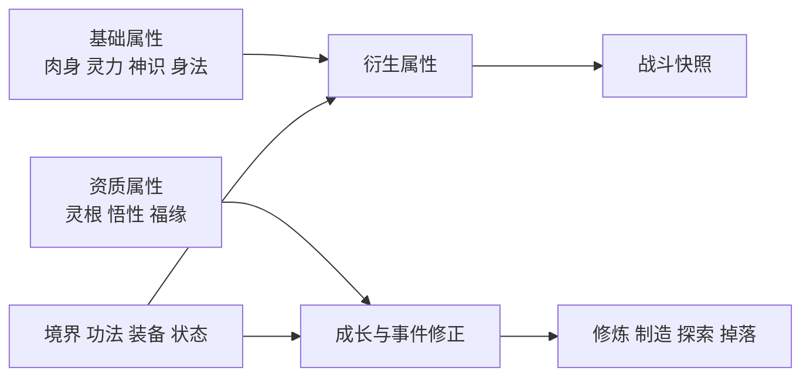

# 基础属性体系设计案

> 目标：建立“角色根基 → 成长方向 → 战斗面板 → 实际结算”的统一数值体系，并兼容当前战斗层的 `hp_max / mp_max / atk / def / spd` 接口。

---

## 1. 设计目标

1. **每项基础属性都有清晰身份**：玩家能理解加点后会获得什么，不出现万能属性。
2. **流派有主属性，也有副属性价值**：肉身流仍需要神识，法修也不能完全放弃肉身。
3. **资质影响成长方式，不直接替代战斗属性**：灵根、悟性、福缘负责塑造路线和事件体验。
4. **衍生属性统一计算**：存档保存根基与永久加成，进入战斗时生成战斗快照。
5. **允许长期成长但避免数值失控**：百分比、减伤、命中、闪避和控制均使用软上限。

---

## 2. 属性分层



| 层级 | 保存方式 | 内容 |
|------|----------|------|
| 根基层 | 永久保存 | 肉身、灵力、神识、身法 |
| 资质层 | 永久保存，极少改变 | 灵根亲和、悟性、福缘 |
| 养成层 | 永久保存 | 境界、功法、装备、永久增益 |
| 面板层 | 动态计算 | 气血、法力、物攻、法攻、物防、法防等 |
| 战斗层 | 进战生成快照 | 当前气血法力、战斗面板、Buff、技能槽 |

**原则：衍生属性不作为独立成长资源。** 玩家获得“肉身 +1”或“物攻 +10”的来源可以同时存在，但最终都由统一计算器生成面板。

---

## 3. 基础属性

建议炼气初期四维基准均为 `10`。同境界常规角色单项范围约为 `6~20`，突破后逐步抬高基准。

| 属性 | 核心身份 | 主要影响 | 次要影响 |
|------|----------|----------|----------|
| 肉身 `body` | 生存与近战 | 气血、物攻、物防、负重 | 出手速度、气血恢复 |
| 灵力 `spirit` | 法术资源与威力 | 法力、法攻、法防 | 飞行续航、阵法驱动 |
| 神识 `sense` | 精准、反应与控制 | 出手速度、命中、控制强度 | 法攻、法防、感知、制造 |
| 身法 `agility` | 位移与规避 | 闪避、移动、追逃 | 少量命中、先手修正 |

### 3.1 属性边界

- 肉身不直接提高闪避，防止它同时成为血量、攻击、防御、速度四合一属性。
- 灵力主要提供“量”和法术强度；控制命中由神识负责。
- 神识不提供大量法力，避免法修只堆神识。
- 身法不直接提高出手频率。它负责“位置速度”，`spd` 负责“行动速度”。

这样可形成四种明确取向：

| 取向 | 主属性 | 副属性 | 优势 | 短板 |
|------|--------|--------|------|------|
| 体修 | 肉身 | 身法 / 神识 | 能扛、近战稳定 | 法力与法防有限 |
| 法修 | 灵力 | 神识 | 法术爆发、续航 | 怕被近身和压制 |
| 控制流 | 神识 | 灵力 | 先手、命中、控制 | 正面数值较低 |
| 游斗流 | 身法 | 神识 / 肉身 | 闪避、追逃、风筝 | 惧怕必中与范围攻击 |

---

## 4. 资质属性

### 4.1 灵根

灵根使用“元素亲和度”表达，而不是简单的有或没有。

```json
{
  "roots": {
    "fire": 80,
    "wood": 35,
    "water": 0
  }
}
```

每种亲和度范围为 `0~100`，影响：

- 对应功法修炼效率；
- 对应技能伤害与治疗效果；
- 对应技能法力消耗；
- 功法、法宝和事件的适配条件。

推荐公式：

```text
元素效果倍率 = 0.85 + 对应亲和度 × 0.003
元素功法修炼倍率 = 0.70 + 对应亲和度 × 0.006
```

示例：火亲和 `80` 时，火系效果为 `1.09` 倍，火系修炼效率为 `1.18` 倍。

**多灵根不应只是劣化单灵根。** 单灵根专精成长快，多灵根则获得功法组合、元素反应和更广事件解法。

### 4.2 悟性 `comprehension`

悟性只影响“学得多快、参得多深”，不直接增加伤害：

```text
参悟效率倍率 = 0.75 + 悟性 / (悟性 + 50)
```

建议作用：

- 功法经验获取；
- 神通解锁速度；
- 炼丹炼器的配方理解与品质上限；
- 闭关、石碑、剑痕等参悟事件。

### 4.3 福缘 `fortune`

福缘影响机会质量，不直接影响战斗胜负：

```text
稀有事件权重倍率 = 1 + 福缘 / (福缘 + 100)
```

建议作用：

- 稀有事件与隐藏分支权重；
- 战利品品质升级概率；
- 危险事件中的“逢凶化吉”选项；
- 奇遇保底进度。

福缘必须搭配**保底计数和固定种子**，避免反复读档刷结果。

---

## 5. 衍生属性

以下为炼气初期的首版基准公式。境界、功法、装备提供额外加值与倍率。

### 5.1 生存与资源

```text
气血上限 hp_max = 50 + 肉身 × 5 + 境界气血 + 固定加值
法力上限 mp_max = 50 + 灵力 × 5 + 境界法力 + 固定加值

气血恢复 hp_regen = 0.5 + 肉身 × 0.05
法力恢复 mp_regen = 0.5 + 灵力 × 0.04 + 神识 × 0.01
负重 carry = 20 + 肉身 × 2
```

### 5.2 攻防

```text
物理攻击 physical_atk = 肉身 × 3 + 武器攻击 + 固定加值
法术攻击 magic_atk = 灵力 × 2.4 + 神识 × 0.8 + 法器攻击 + 固定加值

物理防御 physical_def = 肉身 × 2 + 护甲防御 + 固定加值
法术防御 magic_def = 灵力 × 1.2 + 神识 × 1.2 + 法器防御 + 固定加值
```

实际面板统一按以下顺序计算：

```text
最终属性 = max(0, (基础推导值 + 所有固定加值) × (1 + 所有百分比加值))
```

同类百分比先相加，避免多个乘区造成后期指数膨胀。

### 5.3 速度、命中与闪避

```text
出手速度 action_speed = 50 + 神识 × 3 + 肉身 × 2 + 功法加值
命中 rating_accuracy = 50 + 神识 × 3 + 身法 × 1 + 功法加值
闪避 rating_evasion = 50 + 身法 × 3 + 神识 × 1 + 功法加值

移动速度 move_speed = 基础移动 × (1 + 身法 / (身法 + 100))
追逃评分 chase = 身法 × 3 + 神识 × 1 + 功法加值
```

现有走条系统可直接令 `spd = action_speed`：

```text
出手间隔 = clamp(1.2 × 100 / spd, 0.3, 12.0) 秒
```

这与当前 `ZhandouBalance` 的实际运行公式一致，`spd=100` 时约为 `1.2 秒/次`。

### 5.4 命中判定

使用攻防评分对抗，不把闪避直接做成可无限堆叠的百分比：

```text
命中率 = clamp(
  0.85 + (命中评分 - 闪避评分) / (命中评分 + 闪避评分 + 200),
  0.35,
  0.98
)
```

- 同评分时命中率为 `85%`；
- 常规攻击受命中判定；
- 范围技能可获得命中修正；
- “必中”只应出现在少量高成本技能上。

### 5.5 控制

```text
控制强度 control_power = 神识 × 3 + 灵力 × 1 + 功法加值
控制抗性 control_resist = 神识 × 2 + 肉身 × 1 + 功法加值

控制成功率 = clamp(
  技能基础成功率 + (控制强度 - 控制抗性) / (控制强度 + 控制抗性 + 200),
  0.15,
  0.95
)
```

控制时长另受韧性修正，Boss 可拥有控制时长上限，但不建议完全免疫。

---

## 6. 伤害结算

当前 `max(1, atk - def)` 在攻防接近时容易出现大量 `1` 点伤害，并使少量防御跨过临界点后收益过高。建议改为软减伤公式：

```text
原始伤害 = 对应攻击 × 技能倍率 + 技能固定伤害
减伤率 = 对应防御 / (对应防御 + 境界防御常数)
结算伤害 = max(1, 原始伤害 × (1 - 减伤率) × 其他倍率)
```

炼气期可令“境界防御常数”取 `100`：

| 防御 | 减伤率 |
|------|--------|
| 25 | 20% |
| 50 | 33% |
| 100 | 50% |
| 200 | 67% |

伤害类型决定使用的攻防：

| 类型 | 攻击属性 | 防御属性 |
|------|----------|----------|
| 物理 | `physical_atk` | `physical_def` |
| 法术 | `magic_atk` | `magic_def` |
| 真实 | 技能固定值 | 不减伤，仅少量使用 |

元素克制、暴击、易伤、护盾应在攻防结算之后处理，并统一记录在战斗报告中。

---

## 7. 暴击与特殊属性

暴击不建议直接由四维基础属性大量提供，否则会挤压装备与功法的设计空间。

| 属性 | 主要来源 | 建议限制 |
|------|----------|----------|
| 暴击率 `crit` | 武器、功法、神通、状态 | 面板软上限 60% |
| 暴击伤害 `crit_damage` | 武器、功法、神通 | 初始 150%，建议上限 300% |
| 护盾 `shield` | 技能与法宝 | 运行时资源，不是永久面板 |
| 穿透 | 高阶技能、法宝 | 分物穿与法穿，使用百分比软上限 |
| 吸血 / 回复增强 | 功法与状态 | 对 Boss 和持续伤害单独限制 |

---

## 8. 成长与加点

### 8.1 成长来源

| 来源 | 推荐产出 |
|------|----------|
| 境界突破 | 四维小幅整体增长、境界基础值、机制解锁 |
| 修炼功法 | 指定基础属性、衍生百分比、技能效果 |
| 丹药淬体 | 有次数或耐药限制的永久属性 |
| 装备法宝 | 固定衍生属性、流派词条、主动效果 |
| 奇遇机缘 | 稀有特质、灵根变化、特殊规则 |

### 8.2 加点约束

- 每次突破给予有限“根基点”，让玩家主动塑造路线。
- 单项属性超过当前境界推荐值后，提高继续加点成本。
- 洗点应存在，但有代价；灵根重塑比普通洗点更稀有。
- 不设置纯粹的“战力值”参与结算，战力只可作为 UI 估算。

### 8.3 境界压制

境界差应通过境界基础值、技能阶位和防御常数体现，不建议使用“一境界直接伤害翻倍”的硬倍率。这样低境界专精角色仍有越级可能，但代价明显。

---

## 9. 非战斗系统接入

| 场景 | 主要属性 | 设计方式 |
|------|----------|----------|
| 炼丹 / 炼器 | 神识 + 悟性 + 对应功法 | 决定成功率、品质与材料容错 |
| 阵法 | 灵力 + 神识 | 灵力决定驱动规模，神识决定控制精度 |
| 飞行 | 灵力 + 身法 | 灵力决定续航，身法决定速度与安全 |
| 采集 / 搬运 | 肉身 + 神识 | 肉身影响负重，神识影响发现与品质 |
| 参悟事件 | 悟性 + 神识 | 悟性决定效率，神识决定可尝试门槛 |
| 奇遇事件 | 福缘 | 改变候选权重并推动保底，不直接判定必成 |
| 追击 / 逃跑 | 身法 + 神识 | 使用双方追逃评分对抗 |

事件选项应展示属性门槛或成功率趋势，例如“以神识参悟（把握较高）”，让属性构筑在历练中持续有反馈。

---

## 10. 数据结构建议

```json
{
  "foundations": {
    "body": 10,
    "spirit": 10,
    "sense": 10,
    "agility": 10
  },
  "aptitudes": {
    "comprehension": 10,
    "fortune": 10,
    "roots": {
      "fire": 80,
      "wood": 35
    }
  },
  "permanent_modifiers": {
    "flat": {},
    "percent": {}
  }
}
```

进入战斗时由属性计算器生成：

```json
{
  "hp_max": 100,
  "mp_max": 100,
  "physical_atk": 30,
  "magic_atk": 32,
  "physical_def": 20,
  "magic_def": 24,
  "spd": 100,
  "accuracy": 90,
  "evasion": 90,
  "control_power": 40,
  "control_resist": 30,
  "crit": 10,
  "crit_damage": 150,
  "shield": 0
}
```

配置字段建议统一使用英文稳定键，中文名称只在 UI 文案表中维护。

---

## 11. 与当前项目的兼容方案

当前战斗系统只识别 `atk / def / spd`。建议分三阶段接入：

### 阶段一：先建立根基与计算器

- 新增根基、资质和属性计算服务；
- `hp_max / mp_max / spd` 使用新公式生成；
- 临时映射 `atk = max(physical_atk, magic_atk)`；
- 临时映射 `def = min(physical_def, magic_def)`，保持旧技能可运行。

### 阶段二：拆分攻防与技能类型

- 战斗快照加入 `physical_atk / magic_atk / physical_def / magic_def`；
- 技能配置明确 `damage_type`；
- 替换减法防御公式；
- 普攻使用物理攻防，法术按技能类型选择攻防。

### 阶段三：接入命中、闪避与控制

- 战斗报告加入 `miss / control_result`；
- 技能加入命中修正、控制基础率与元素标签；
- 历练选项接入神识、身法、悟性、福缘判定；
- 角色面板分为“根基 / 战斗 / 资质”三页。

迁移期间保留旧字段读取，所有新存档只保存根基数据与必要的运行时气血法力，衍生面板随时重新计算。

---

## 12. 首版范围与平衡验证

首版建议只上线以下内容：

1. 四维基础属性、灵根、悟性、福缘；
2. 气血、法力、物攻、法攻、物防、法防、出手速度；
3. 物理与法术伤害类型；
4. 新防御减伤公式；
5. 角色面板展示与战斗快照生成。

命中闪避、控制、元素克制、制造成功率和福缘保底放在后续迭代，避免一次改动过大。

平衡测试至少覆盖：

- 同境界平均构筑的战斗时长；
- 纯体修、纯法修、控制流、游斗流互相对战；
- 单属性极限堆叠是否压过所有混合构筑；
- 防御、速度、暴击接近上限时的边际收益；
- 低境界挑战高境界的成功率与资源消耗；
- 灵根、悟性、福缘在十次以上历练中的长期收益。
