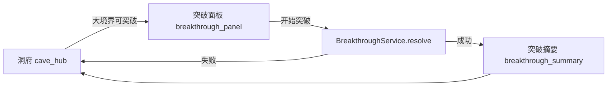

# 修仙突破系统设计案

> **维护约定**：调整突破逻辑、配置表或场景时，同步更新正文各节；变更摘要仅写入文末「变更记录」。

---

## 1. 系统概述

突破是洞府主循环中的**大境界跃迁玩法**：炼气期内小层仍由修为达标自动提升；当修为达到当前大境界顶层且下一阶为大境界时，玩家进入突破面板，综合七项「突破值」评估品质后尝试突破。

核心公式：

```
突破值 = 修为 + 丹药 + 心境 + 根骨 + 气运 + 特殊功法 + 其他
```

- **突破值 < 最低门槛**：不可开始突破（按钮禁用，提示「突破值过低，无法突破」）。
- **突破值 ≥ 最低门槛**：可尝试；落在不同区间决定**品质档**（下品 → 一品），进而影响成功率、根基成长、永久加成与后续修炼效率。



### 与现有逻辑的关系

| 场景 | 现有行为 | 新行为 |
|------|----------|--------|
| 炼气一层 → 二层（同 `major_realm`） | 修为达标自动升层 | **不变** |
| 炼气九层 → 筑基初期 | 一键突破，四维 +1 | 打开突破面板，按品质结算 |
| 筑基 → 金丹、金丹 → 元婴 | 同上 | 同上，品质名分别为「X品筑基 / 金丹 / 元婴」 |
| 筑基初期 → 中期（同大境界） | 修为达标自动升层 | **不变** |

---

## 2. 突破值七项构成

每项由 `BreakthroughService` 从存档与配置实时计算，**不单独持久化总和**（避免与分项不同步）。

| UI 名称 | 配置键 | 主要数据来源 | 计算要点 |
|---------|--------|--------------|----------|
| 修为 | `cultivation` | `GameState.cultivation`、`breakthrough_at` | 修为占门槛比例映射到 `[0, cultivation_cap]` |
| 丹药 | `pills` | `savedata.breakthrough_bonuses.pills`、本次备丹 | 已服用破境丹、淬体丹等累计加成 |
| 心境 | `mind` | 伤势、近期历练、心境 buff | 基础值 − 伤势惩罚 + 事件/休息加成 |
| 根骨 | `aptitude` | `foundations`、`aptitudes.roots` | 四维根基均值 + 主灵根强度加权 |
| 气运 | `fortune` | `aptitudes.fortune` | 福缘线性映射 |
| 特殊功法 | `special_method` | 已装备功法中带 `breakthrough_bonus` 的条目 | 主功法权重最高，辅助/身法递减 |
| 其他 | `other` | 世界状态、装备词条、一次性 buff | `breakthrough_bonuses.other` 与临时加成之和 |

### 2.1 修为项（示例公式）

```
修为项 = floor( min(cultivation, breakthrough_at) / breakthrough_at * cultivation_cap )
```

炼气九层 → 筑基时 `breakthrough_at = 1620`，`cultivation_cap = 400`：  
修为 1620 → 400 点；修为 810 → 200 点。

### 2.2 存档扩展字段

在 `DataStore._default_savedata()` 增加（经 `coalesce_savedata` 兼容旧档）：

```json
{
  "breakthrough_bonuses": {
    "pills": 0,
    "mind": 0,
    "other": 0
  },
  "realm_quality": {
    "foundation": 0,
    "core": 0,
    "nascent": 0
  },
  "breakthrough_attempt_cooldown_days": 0
}
```

- `breakthrough_bonuses`：跨局累计的破境准备（服丹、奇遇等写入）。
- `realm_quality`：已达成的大境界品质，`0` 表示尚未突破该大境界；`1` 为一品（最佳），`5` 为下品。
- `breakthrough_attempt_cooldown_days`：失败后的调息冷却（可选，首版可为 0）。

---

## 3. 品质档位与效果

仅 **大境界突破**（`major_realm` 变化）使用品质表。配置位于 `data/breakthrough_rules.json` 的 `major_breakthroughs`。

### 3.1 炼气九层 → 筑基（示例，与 UI 稿一致）

| 突破值区间 | 品质 | 显示名 | 成功率 | 根基成长 | 额外效果 |
|------------|------|--------|--------|----------|----------|
| &lt; 1200 | — | 不可突破 | — | — | 按钮禁用 |
| 1200 – 1499 | 5 | 下品筑基 | 65% | 四维各 +1.0 | 筑基修炼速度 −5% |
| 1500 – 1799 | 4 | 中品筑基 | 80% | 四维各 +1.2 | 无额外惩罚 |
| 1800 – 2099 | 3 | 上品筑基 | 92% | 四维各 +1.5 | 解锁上品筑基被动槽 |
| 2100 – 2399 | 2 | 极品筑基 | 97% | 四维各 +1.8 | 气血/法力上限 +3% |
| ≥ 2400 | 1 | **一品筑基** | 100% | 四维各 +2.0 | 全属性 +2%、后续破境门槛 −3% |

### 3.2 筑基 → 金丹、金丹 → 元婴

结构相同，键名分别为 `foundation_to_core`、`core_to_nascent`：

- 品质显示：**一品金丹**、**一品元婴** 等（`tier_labels` 按 `major_realm` 替换后缀）。
- 数值随境界抬高：最低门槛、区间宽度、`cultivation_cap` 等见配置表。
- 金丹/元婴除根基成长外，可增加：**丹海/元婴法身** 相关被动、突破失败「境界不稳」debuff 时长等（首版可仅文本区分）。

### 3.3 失败与「境界不稳」

- 突破值 ≥ `min_total` 但掷点失败：境界不升，进入 `realm_unstable_days`（默认 3 日），期间修炼收益 −30%、伤势恢复变慢。
- 一品档 `success_rate = 1.0`，不失败。
- 失败不消耗「修为项」对应的修为数值，但可消耗本次备丹（配置 `consume_pills_on_fail`）。

---

## 4. UI 设计（对齐原型稿）

场景：`scenes/sim/breakthrough_panel.tscn`（新建）

| 区域 | 节点职责 |
|------|----------|
| 顶栏 | 标题「修仙突破」、角色名、当前境界、灵石 |
| 左栏「突破值构成」 | 七项分项数值 + 问号说明 + **突破值总计** |
| 中央 | 角色立绘/打坐、**当前境界 → 目标境界**、进度条 `总计 / min_total`、状态文案（过低/可突破/推荐区间） |
| 右栏「突破值评估」 | 半圆仪表（指针按 `total / tier_max`）、区间色带、突破说明 |
| 底栏「提升途径」 | 七项快捷入口（修炼、炼丹、休息、属性、功法等），仅跳转，不在此场景改数 |
| 主按钮 | 「开始突破」：`total < min_total` 时禁用 |

### 场景流改造

1. `cave_hub`：`can_breakthrough()` 为真时，点击突破 → `SceneManager.go_breakthrough_panel()`（不再直接 `GameState.breakthrough()`）。
2. 面板确认后调用 `GameState.attempt_major_breakthrough()` → 内部 `BreakthroughService.resolve()`。
3. 成功 → 现有 `breakthrough_summary`；失败 → 回洞府并刷新 debuff 文案。

---

## 5. 模块与配置

### 5.1 文件索引

| 模块 | 路径 | 职责 |
|------|------|------|
| 规则表 | `data/breakthrough_rules.json` | 分项上限、大境界门槛与品质区间 |
| 计算服务 | `scripts/sim/breakthrough_service.gd` | 分项聚合、档位判定、结算预览 |
| 状态写入 | `scripts/sim/game_state.gd` | `attempt_major_breakthrough()`、`can_breakthrough()` 扩展 |
| 突破面板 | `scenes/sim/breakthrough_panel.tscn` + `.gd` | 数据绑定与按钮 |
| 洞府入口 | `scripts/sim/cave_hub.gd` | 跳转突破面板 |

### 5.2 服务 API（摘要）

```gdscript
# 分项明细 + 总计
BreakthroughService.compute_breakdown(savedata, target_major_realm) -> Dictionary

# 当前是否可尝试（修为达标 + 大境界 + 总分 ≥ min_total）
BreakthroughService.can_attempt(savedata, realms, realm_index) -> Dictionary

# 预览品质档与成功率
BreakthroughService.evaluate_tier(total, transition_id) -> Dictionary

# 执行突破：{ ok, success, tier, old_realm, new_realm, growth, error }
BreakthroughService.resolve(savedata, realms, realm_index, rng) -> Dictionary
```

`compute_breakdown` 返回示例：

```json
{
  "components": {
    "cultivation": 320,
    "pills": 150,
    "mind": 120,
    "aptitude": 100,
    "fortune": 80,
    "special_method": 60,
    "other": 40
  },
  "total": 870,
  "transition_id": "qi_to_foundation",
  "min_total": 1200,
  "target_realm_name": "筑基初期",
  "can_attempt": false,
  "hint": "突破值过低，无法突破"
}
```

### 5.3 配置结构

见 `data/breakthrough_rules.json`：

- `component_caps`：七项理论上限（UI 分母、平衡用）。
- `major_breakthroughs.<transition_id>`：`from_major`、`to_major`、`min_total`、`tiers[]`。
- `tier` 字段：`min_total`（含）、`quality`（1 最好）、`label`、`success_rate`、`foundation_growth`、`perks[]`。

---

## 6. 接入其他系统（分期）

| 阶段 | 内容 |
|------|------|
| **P0** | 规则表 + `BreakthroughService` + 洞府跳转 + 面板只读展示 + 大境界结算写 `realm_quality` |
| **P1** | 破境丹写入 `breakthrough_bonuses.pills`；功法表 `breakthrough_bonus`；失败 debuff |
| **P2** | 仪表动画、提升途径跳转、突破摘要展示品质与 perks |
| **P3** | 金丹/元婴独有机制（丹纹、元婴法相等） |

---

## 7. 测试要点

- 炼气小层：修为达标仍自动升层，不打开面板。
- 炼气九层、修为 1620、分项总和 870：`can_attempt = false`。
- 分项总和 1200：可尝试，品质为下品筑基，成功率 65%。
- 分项总和 2400：一品筑基，成功率 100%，`realm_quality.foundation = 1`。
- 旧存档无 `breakthrough_bonuses` / `realm_quality`：合并默认值后不报错。
- 突破成功后 `foundations` 按档位成长，而非固定 +1。

---

## 变更记录

| 日期 | 摘要 |
|------|------|
| 2026-06-11 | 初版：七项突破值公式、大境界品质档（一品筑基/金丹/元婴）、UI 与模块划分 |
