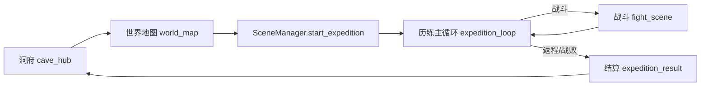

# 历练系统设计案

> **维护约定**：调整历练逻辑、配置表或场景时，同步更新正文各节；变更摘要仅写入文末「变更记录」。

---

## 1. 系统概述

历练是洞府主循环中的**外出探索玩法**：玩家经世界地图选野外区域或地点 → 进入事件循环（日推进 + 抉择 + 战斗）→ 可随时返程或战败结算 → 回写存档（天数、气血法力、背包、世界状态、统计）。

核心设计：**局内状态走 `DataStore.expedition_runtime()`**，结算结果经 `ExpeditionResult` 契约交给 `GameState.settle_expedition()` 持久化。



---

## 2. 功能点总览

| # | 功能 | 简述 | 实现要点 |
|---|------|------|----------|
| F01 | 入口与互斥 | 洞府「外出历练」进世界地图；历练进行中禁止重复出发 | `cave_hub` → `SceneManager.go_world_map()`；`SceneManager` 拦截活跃历练 |
| F02 | 地点选择与启程 | 地图弹窗展示危险度、推荐境界、预览奖励、探索深度档；确认后启程 | `world_map_controller.gd` 野外/地点弹窗 + `data/locations.json` |
| F03 | 启程 | 校验地点、快照玩家、初始化 RNG/统计/日志 | `ExpeditionState.start()` |
| F04 | 日推进 | 遭遇日间隔 timer；无遭遇日由 `advance_day()` 连续过天、不写日志、不等待 | `_advance_single_day()` 链式至遭遇或上限 |
| F05 | 事件导演 | 从地点事件池按权重抽事件，考虑难度范围/链/世界/资源 | `ExpeditionDirectorService.select_next_event()` |
| F06 | 自动事件 | travel / gather / recover / hazard 即时结算 | `ExpeditionEventService.resolve_non_battle_event()` |
| F07 | 抉择事件 | 多选项卡片 UI，选项可触发子事件、效果或战斗 | `mode: decision` + `expedition_event_card` |
| F08 | 战斗事件 | battle / elite / boss，弹窗选迎战或撤退 | `expedition_battle_popup` + `build_battle_init()` |
| F09 | 战斗衔接 | 进战 source=`expedition`，战后回历练循环或战败结算 | `ExpeditionBattleFlow` |
| F10 | 历练日数 | `days` 与事件数 `steps` 独立；结算消耗以 `days` 为准 | `estimated_elapsed_days()`、`finish()` |
| F11 | 事件难度 | 事件配置 `difficulty`；地点 `min_difficulty`/`max_difficulty` 控制入池；难度不随推进自动增加；结算统计 `max_difficulty` | `ExpeditionDirectorService._pool_candidates()` |
| F27 | 推进模式 | 底栏可切换自动/手动推进；手动时每个事件完成后点「前进」才抽下一事件 | `auto_advance` + `AdvanceButton` |
| F12 | 局内 runtime | 历练中 HP/MP/背包槽物品仅在 `runtime` 变更；战斗消耗扣背包副本，历练进行中不写存档 | `runtime` + `receive_battle_summary`；结算时 `settle_expedition()` 统一回写 |
| F13 | 会话战利品 | 遭遇奖励先入 `loot` 展示，结算时与背包一并写入存档 | `ExpeditionRewardService.merge_into_loot()` |
| F14 | 事件日志 | 仅遭遇日写入 BBCode 叙事日志 | `ExpeditionLogService` + `event_log` |
| F15 | 事件链 | `chain_id` 串联狼王/剑冢/魔修等剧情线 | Director 过滤 + `active_chain_id` |
| F16 | 结局事件 | `risk_text: 结局` 仅在对应链激活后出现 | `ExpeditionDirectorService._is_available()` |
| F17 | 世界权重 | 世界状态影响链事件抽取权重 | `wolf_threat` / `sword_tomb_opening` / `sect_unrest` |
| F18 | 世界效果 | 完成带 `world_effects` 的事件后写入结算 | `finish()` → `GameState._apply_world_changes()` |
| F19 | 低资源保底 | HP/MP 比例 < 35% 优先抽 recover | Director `_resource_ratio()` |
| F20 | 单次事件 | `once_per_expedition` 本局不重复 | `completed_events` / `visited_once_events` |
| F21 | 主动返程 | 非战斗、非待抉择时可退出 | `can_exit()` + `go_expedition_result("manual")` |
| F22 | 战败 | 战斗失败强制结算；扣背包、伤势、气血下限 | `settle_pending_battle()` → `finish("defeated")` |
| F23 | 战前撤退 | 战斗弹窗选撤退，记手动返程 | `retreat_from_pending_battle()` |
| F24 | 结算页 | 统计、战利品、损失、世界变化、历练纪要 | `expedition_result.gd` |
| F25 | 存档回写 | 推进天数、同步物品、累计 totals、活动日志 | `GameState.settle_expedition()` |
| F26 | 配置校验 | 地点池、事件、战斗初始化、奖励合法性 | `ExpeditionDataValidator` + 测试 |

---

## 3. 场景与模块索引

### 3.1 场景流

| 场景 ID | 路径 | 脚本 |
|---------|------|------|
| `world_map` | `scenes/map/map.tscn` | `world_map_controller.gd`（历练入口） |
| `expedition_loop` | `scenes/expedition/expedition_loop.tscn` | `expedition_loop.gd` |
| `expedition_result` | `scenes/expedition/expedition_result.tscn` | `expedition_result.gd` |
| `expedition_battle_popup` | `scenes/expedition/expedition_battle_popup.tscn` | `expedition_battle_popup_view.gd` |
| `expedition_event_card` | `scenes/expedition/expedition_event_card.tscn` | `expedition_event_card.gd` |

### 3.2 Autoload / 服务

| 模块 | 路径 | 职责 |
|------|------|------|
| `ExpeditionState` | `scripts/expedition/expedition_state.gd` | 历练状态机、日推进、战斗/结算编排 |
| `ExpeditionDirectorService` | `scripts/expedition/expedition_director_service.gd` | 下一事件抽取 |
| `ExpeditionEventService` | `scripts/expedition/expedition_event_service.gd` | 事件查询、抉择解析、非战斗结算、敌人生成 |
| `ExpeditionRewardService` | `scripts/expedition/expedition_reward_service.gd` | 奖励 roll、发放、战败掉物 |
| `ExpeditionRulesService` | `scripts/expedition/expedition_rules_service.gd` | 规则表、遭遇概率、天数换算 |
| `ExpeditionLogService` | `scripts/expedition/expedition_log_service.gd` | 日志条目与 BBCode 格式化 |
| `ExpeditionFlowService` | `scripts/expedition/expedition_flow_service.gd` | `finish` + `settle` 一站式结算 |
| `ExpeditionBattleFlow` | `scripts/expedition/expedition_battle_flow.gd` | 战斗场景出口回调 |
| `LocationService` | `scripts/expedition/location_service.gd` | 地点配置读取 |
| `SceneManager` | `scripts/core/scene_manager.gd` | `start_expedition` / 场景跳转与互斥 |
| `ExpeditionResult` | `scripts/core/contracts/expedition_result.gd` | 结算数据结构校验 |

### 3.3 配置表

| 文件 | 内容 |
|------|------|
| `data/locations.json` | 地点元数据、难度、公共/地图事件池，以及公共事件的地图级奖励、敌人、耗时生成参数 |
| `data/expedition_common_events.json` | 可跨地图复用的公共事件模板（赶路、采集、恢复、普通战斗等） |
| `data/expedition_events.json` | 与地图绑定的大多数唯一事件（抉择、事件链、精英、首领、世界效果等） |
| `data/expedition_rules.json` | 全局规则（遭遇概率、战败惩罚、自动推进间隔等） |

地点通过 `expedition_mode` 软分型：

| mode | 用途 | 事件池规则 |
|------|------|------------|
| `resource` | 刷材料地图 | 只配置 `common_event_pool` 与 `common_event_generation`，`map_event_pool` 必须为空 |
| `story` | 剧情/事件地图 | 只配置 `map_event_pool`，`common_event_pool` 必须为空 |

---

## 4. 状态机

### 4.1 `phase`（局内阶段）

| phase | 含义 | 可执行操作 |
|-------|------|------------|
| `idle` | 未历练 | — |
| `resolving` | 等待下一日推进或结算非战斗 | 自动 timer 或手动「前进」、`advance_day` / `complete_current_step` |
| `choosing` | 抉择事件，展示选项卡 | `choose_event(choice_id)` |
| `battle` | 待确认战斗（弹窗） | 迎战 → 战斗场景；撤退 → 结算 |
| `result` | 战败待跳转结算 | `should_go_to_result()` |

### 4.2 退出原因 `exit_reason`

| 值 | 触发 |
|----|------|
| `manual` | 主循环点返程；战前撤退 |
| `defeated` | 战斗失败 |

### 4.3 `DataStore.expedition_runtime()` 主要字段

```
active, phase, location_id, expedition_id, start_day
auto_advance, steps, days, days_without_event, seed, rng_state
active_chain_id, completed_events, visited_once_events
runtime { hp, mp, item_slots, inventory }
loot[], event_log[], stats{}, player_snapshot{}
pending_decision_event, current_choices, current_event_id
pending_battle_event_id, pending_battle_summary, pending_battle_rewards
pending_exit_reason
```

---

## 5. 核心流程说明

### 5.1 启程

1. `SceneManager.start_expedition(location_id)` 预检 → `ExpeditionState.start()`  
2. 复制 `player_snapshot`（属性、技能、装备）与 `runtime`（HP/MP/背包）  
3. 写 departure 日志 → `go_expedition_loop()`

### 5.2 单日推进

```
advance_day()
  → 循环 _advance_single_day()（空窗日不等待，直接再过一日；上限 32 日/次）
  → 单日：days++ → 按 event_day_chance 判定遭遇（连续空窗达 max_idle_days 保底）
  → 未遭遇 → mode=pass_day（无日志，继续循环）
  → 遭遇 → Director 抽事件
       → decision? → phase=choosing，展示 EventCards
       → 否则 _begin_auto_event
            → 战斗类? → phase=battle，弹 BattlePopup
            → 否则 mode=resolving，complete_current_step 结算
```

非战斗结算：`resolve_non_battle_event` → 应用 effects / roll rewards → `_apply_step_after_event`（`steps++`、更新 `max_difficulty`、日志、链标记）。

公共事件由 `common_event_pool` 引用模板，并在抽取时使用地点的 `common_event_generation` 物化。生成实例 ID 为
`common::<location_id>::<template_id>`，因此奖励、敌人和 `duration_days` 可随当前地图变化，同时战斗跨场景后仍可按 ID 恢复。

公共事件只服务 `resource` 地图，用于材料、普通战斗、恢复和地形消耗循环；`story` 地图不使用公共模板，只从 `map_event_pool` 抽取地图专属剧情、抉择、战斗和事件链。

### 5.3 战斗

1. `build_battle_init()`：玩家用 `runtime` 快照，敌人 `build_battle_enemy(event)`  
2. `SceneManager.go_fight(..., "expedition")`  
3. 战后 `ExpeditionBattleFlow.handle_battle_finished` → `receive_battle_summary`（胜方预 roll 奖励）  
4. 战斗结算 UI 关闭 → `settle_pending_battle()`：仅更新 `runtime`（气血法力、槽位丹药余量），奖励记入 `loot`  
   - **胜**：记日志、回 `resolving`  
   - **负**：`pending_exit_reason=defeated`，`phase=result` → 结算场景

### 5.4 返程与结算

1. `ExpeditionFlowService.settle_active_expedition(reason)`  
2. `ExpeditionState.finish(reason)` 组装 `ExpeditionResult`（含 `runtime` 快照、loot、战败 `loot_lost` 等）  
3. `GameState.settle_expedition()` 统一回写：天数、HP/MP、槽位背包、会话 `loot`、战败掉物、injury、totals、活动日志  
4. `ExpeditionState.reset()` 清空 runtime

---

## 6. 事件类型与配置

### 6.1 事件 `type`

| type | 行为 |
|------|------|
| `travel` | 纯叙事，无数值变化 |
| `gather` | roll `rewards` |
| `recover` / `hazard` | 应用 `effects`（百分比 HP/MP 增减） |
| `battle` / `elite` / `boss` | 进入战斗 |
| `decision`（配合 `mode: decision`） | 多选项，见下 |

### 6.2 难度

- 事件 `difficulty`：该事件的固定难度值（默认 1）  
- 地点 `min_difficulty` / `max_difficulty`：本地点历练可抽取的事件难度范围（`max_difficulty` 为 0 表示无上限）  
- 难度不随事件完成自动增加；导演仅按地点范围与事件 `difficulty` 过滤入池  
- 精英、首领通过独立事件配置与更高 `difficulty` 区分，运行时不对属性或奖励做倍率

### 6.3 抉择选项

选项字段（`options[]`）：

- `trigger_event`：指向另一事件（可链到战斗或非战斗）  
- `effects` + `rewards`：直接在本选项结算  
- `label` / `desc` / `risk_text`：UI 与日志文案  

选项 ID 格式：`{parent_id}::{option_id}`（`decision_choice_id`）。

### 6.4 效果 `effects`

| type | 作用 |
|------|------|
| `heal_hp_percent` | 按最大气血比例恢复 |
| `restore_mp_percent` | 按最大法力比例恢复 |
| `damage_hp_percent` | 按最大气血比例受伤（保底 1 HP） |
| `drain_mp_percent` | 按最大法力比例消耗 |

### 6.5 奖励 `rewards`

- 加权池 + `reward_rolls` 次抽取  
- `min`/`max` 随机决定数量  
- 种类：`item` / `currency` / `equip`（经 `RewardService` 合并）

### 6.6 事件链（以青岚山为例）

| chain_id | 主题 | 结局事件 | 世界效果示例 |
|----------|------|----------|--------------|
| `wolf_king` | 狼王线 | `wolf_hunt_ending` | 狼王 boss：`wolf_threat -20` |
| `sword_tomb` | 剑冢线 | `sword_tomb_ending` | 结局：`sword_tomb_opening +25` |
| `demonic_ritual` | 魔修线 | `demonic_ritual_ending` | 血祭 boss：`sect_unrest -25` |

链机制：完成带 `chain_id` 的事件后设置 `active_chain_id`；导演优先同链候选；结局事件需 `risk_text == "结局"` 且链已激活。

---

## 7. 规则参数（`expedition_rules.json`）

| 键 | 默认 | 含义 |
|----|------|------|
| `minimum_elapsed_days` | 1 | 结算最少天数 |
| `event_day_chance` | 0.55 | 每日遭遇事件概率 |
| `max_idle_days` | 4 | 连续无事件天数上限，达到后次日保底遭遇 |
| `auto_event_advance_seconds` | 1.0 | 遭遇日之间的自动推进间隔（秒）；空窗日不适用 |
| `defeat_hp_floor_ratio` | 0.25 | 战败后气血下限（相对 max） |
| `defeat_injury_days` | 3 | 战败伤势天数 |
| `defeat_inventory_drop_*` | 见 JSON | 战败随机丢失背包堆数与比例 |

---

## 8. UI 行为摘要

| 区域 | 数据源 |
|------|--------|
| 顶栏 | 地点名、难度范围、已消耗 `days` |
| 状态行 | 第 `days` 日 · `steps` 件事 |
| 气血/法力条 | `runtime` + `player_snapshot.attrs` |
| 丹药槽 | `runtime.item_slots` + `inventory` |
| 战利品区 | `ExpeditionState.loot` |
| 日志 | `event_log` → BBCode（仅遭遇日） |
| 抉择卡 | `pending_decision_event` → `current_choices` |
| 返程按钮 | `can_exit()` |
| 前进按钮 | 手动推进时，事件结算后可见，触发 `advance_day` |
| 自动推进开关 | 切换 `auto_advance`；开启时沿用 timer 连续推进 |
| 战斗弹窗 | 敌人信息 + 迎战/撤退 |

---

## 9. 测试与校验

| 入口 | 覆盖 |
|------|------|
| `tests/run_expedition_tests.gd` | 状态机、导演、结算、链与抉择 |
| `tests/run_expedition_smoke.gd` | 端到端烟雾 |
| `tests/run_config_validation_tests.gd` | `ExpeditionDataValidator` |
| `tests/run_scene_manager_tests.gd` | 场景互斥、启程回滚 |

---

## 10. 架构约束

1. **数据规范**：所有跨场景历练状态必须经 `DataStore.expedition_runtime()`，禁止平行静态全局。  
2. **RNG 可复现**：每步 `_restore_rng` / `_save_rng` 持久化 `rng_state`，支持 `seed_override`（测试用）。  
3. **重复结算防护**：`GameState.last_settled_expedition_id` 与 `settlement_id` 去重。  
4. **战斗来源解耦**：战斗场景只认 `source`，历练逻辑集中在 `ExpeditionBattleFlow`。

---

## 11. 变更记录

| 日期 | 变更摘要 |
|------|----------|
| 2026-06-10 | 初版：自现有代码与配置梳理全功能点 |
| 2026-06-10 | 天数与事件解耦：`days` 独立推进，无遭遇日不产生日志 |
| 2026-06-10 | 深度仅作事件入池门槛，敌人/奖励取消深度倍率 |
| 2026-06-10 | 正文改为只描述当前规则；所有待办移入文末 |
| 2026-06-10 | 移除战斗次数上限（`max_battle_choices`） |
| 2026-06-10 | 移除首领返程专用结算原因（`boss_complete`） |
| 2026-06-10 | 局内 runtime 与存档解耦：消耗与奖励结算时统一回写 |
| 2026-06-10 | 移除 `boss_defeated` 统计与主循环首领返程提示 |
| 2026-06-10 | 空窗日连续推进，不等待 `auto_event_advance_seconds` |
| 2026-06-10 | 移除 `journey_complete` 退出原因（系统从未产出） |
| 2026-06-10 | 深度改为难度：事件 `difficulty`、地点难度范围，取消 `depth` 自动递增 |
| 2026-06-10 | 新增自动/手动推进切换与「前进」按钮 |
| 2026-06-11 | 移除独立地点选择场景；历练入口改经世界地图弹窗与 `start_expedition` |
| 2026-06-16 | 地点新增 `expedition_mode`：材料地图只用公共事件，剧情地图只用地图专属事件 |
