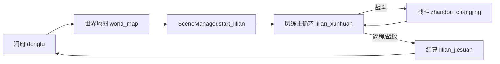

# 历练系统设计案

> **维护约定**：调整历练逻辑、配置表或场景时，同步更新正文各节；变更摘要仅写入文末「变更记录」。

---

## 1. 系统概述

历练是洞府主循环中的**外出探索玩法**：玩家经世界地图选野外区域或地点 → 生成随机网状路线图 → 玩家自由选择相邻节点 → 节点解析为采集、休整、抉择或战斗事件 → 可随时返程或战败结算 → 回写存档（天数、气血法力、背包、世界状态、统计）。

核心设计：**局内状态走 `DataStore.lilian_runtime()`**，结算结果经 `LilianResult` 契约交给 `GameState.settle_lilian()` 持久化。



---

## 2. 功能点总览

| # | 功能 | 简述 | 实现要点 |
|---|------|------|----------|
| F01 | 入口与互斥 | 洞府「外出历练」进世界地图；历练进行中禁止重复出发 | `dongfu` → `SceneManager.go_world_map()`；`SceneManager` 拦截活跃历练 |
| F02 | 地点选择与启程 | 地图弹窗展示危险度、推荐境界、预览奖励、探索深度档；确认后启程 | `world_map_controller.gd` 野外/地点弹窗 + `data/exportjson/didian_locations.json` |
| F03 | 启程 | 校验地点、快照玩家、初始化 RNG/统计/日志，并生成本局路线图 | `LilianState.start()` + `LilianMapService.generate()` |
| F04 | 路线选择 | 玩家点击可达节点推进历练；不可跳层或重复访问已完成节点 | `choose_map_node()` + `current_available_nodes()` |
| F05 | 节点事件解析 | 根据节点类型从地点事件池按权重抽事件，具体内容仍复用现有事件配置 | `LilianEventService.roll_event_for_node()` |
| F06 | 自动事件 | travel / gather / recover / hazard 即时结算 | `LilianEventService.resolve_non_battle_event()` |
| F07 | 抉择事件 | 多选项卡片 UI，选项可触发子事件、效果或战斗 | `mode: decision` + `lilian_shijian_kapian` |
| F08 | 战斗事件 | battle / elite / boss，弹窗选迎战或取消暂缓 | `lilian_zhandou_tanchuang` + `build_battle_init()` |
| F09 | 战斗衔接 | 进战 source=`expedition`，战后回历练循环或战败结算 | `LilianBattleFlow` |
| F10 | 历练日数 | `days` 与事件数 `steps` 独立；进行中显示实际行进日，结算耗时至少为时间规则中的普通历练时长 | `estimated_elapsed_days()`、`planned_elapsed_days()`、`finish()` |
| F11 | 运行时难度 | 事件配置不再写 `difficulty`；节点 difficulty 随层数从地点难度范围递增，抽中事件后注入运行时事件；结算统计 `max_difficulty` | `LilianMapService` + `LilianEventService.materialize_event_for_context()` |
| F27 | 路线图 UI | 主界面展示节点和连线；节点类型明牌，事件名进入节点后解析 | `lilian_ditu_jiedian` + `MapCanvas` |
| F12 | 局内 runtime | 历练中 HP/MP/背包槽物品仅在 `runtime` 变更；战斗消耗扣背包副本，历练进行中不写存档 | `runtime` + `receive_battle_summary`；结算时 `settle_lilian()` 统一回写 |
| F13 | 会话战利品 | 遭遇奖励先入 `loot` 展示，结算时与背包一并写入存档 | `LilianRewardService.merge_into_loot()` |
| F14 | 事件日志 | 仅遭遇日写入 BBCode 叙事日志 | `LilianLogService` + `event_log` |
| F15 | 事件链 | `chain_id` 串联狼王/剑冢/魔修等剧情线 | Director 过滤 + `active_chain_id` |
| F16 | 结局事件 | `risk_text: 结局` 仅在对应链激活后出现 | `ExpeditionDirectorService._is_available()` |
| F17 | 世界权重 | 世界状态影响链事件抽取权重 | `wolf_threat` / `sword_tomb_opening` / `sect_unrest` |
| F18 | 世界效果 | 完成带 `world_effects` 的事件后写入结算 | `finish()` → `GameState._apply_world_changes()` |
| F19 | 低资源保底 | HP/MP 比例 < 35% 优先抽 recover | Director `_resource_ratio()` |
| F20 | 单次事件 | `once_per_lilian` 本局不重复 | `completed_events` / `visited_once_events` |
| F21 | 主动返程 | 非待战、非待抉择时可退出；战前弹窗关闭后的待战状态点返程走战前撤退 | `can_exit()` / `_is_pending_battle_dismissed()` + `go_lilian_jiesuan("manual")` |
| F22 | 战败 | 战斗失败强制结算；固定掉落 30% 本次收获、伤势、气血下限 | `settle_pending_battle()` → `finish("defeated")` |
| F23 | 战前撤退 | 关闭战前弹窗后点「主动返程」，记手动返程 | `retreat_from_pending_battle()` |
| F24 | 结算页 | 统计、战利品、损失、世界变化、历练纪要 | `lilian_jiesuan.gd` |
| F25 | 存档回写 | 推进天数、同步物品、累计 totals、活动日志 | `GameState.settle_lilian()` |
| F26 | 配置校验 | 地点池、事件、战斗初始化、奖励合法性 | `LilianDataValidator` + 测试 |

---

## 3. 场景与模块索引

### 3.1 场景流

| 场景 ID | 路径 | 脚本 |
|---------|------|------|
| `world_map` | `scenes/map/map.tscn` | `world_map_controller.gd`（历练入口） |
| `lilian_xunhuan` | `scenes/lilian/lilian_xunhuan.tscn` | `lilian_xunhuan.gd` |
| `lilian_jiesuan` | `scenes/lilian/lilian_jiesuan.tscn` | `lilian_jiesuan.gd` |
| `lilian_zhandou_tanchuang` | `scenes/lilian/lilian_zhandou_tanchuang.tscn` | `lilian_zhandou_tanchuang_view.gd` |
| `lilian_shijian_kapian` | `scenes/lilian/lilian_shijian_kapian.tscn` | `lilian_shijian_kapian.gd` |

### 3.2 Autoload / 服务

| 模块 | 路径 | 职责 |
|------|------|------|
| `LilianState` | `scripts/lilian/lilian_state.gd` | 历练状态机、路线选择、战斗/结算编排 |
| `LilianMapService` | `scripts/lilian/lilian_map_service.gd` | 随机网状路线图生成、连通性与下一节点计算 |
| `LilianEventService` | `scripts/lilian/lilian_event_service.gd` | 事件查询、抉择解析、非战斗结算、敌人生成 |
| `LilianRewardService` | `scripts/lilian/lilian_reward_service.gd` | 奖励 roll、发放、战败掉物 |
| `LilianRulesService` | `scripts/lilian/lilian_rules_service.gd` | 规则表、遭遇概率、天数换算 |
| `LilianLogService` | `scripts/lilian/lilian_log_service.gd` | 日志条目与 BBCode 格式化 |
| `LilianFlowService` | `scripts/lilian/lilian_flow_service.gd` | `finish` + `settle` 一站式结算 |
| `LilianBattleFlow` | `scripts/lilian/lilian_battle_flow.gd` | 战斗场景出口回调 |
| `DidianService` | `scripts/lilian/didian_service.gd` | 地点配置读取 |
| `SceneManager` | `scripts/core/scene_manager.gd` | `start_lilian` / 场景跳转与互斥 |
| `LilianResult` | `scripts/core/contracts/lilian_result.gd` | 结算数据结构校验 |

### 3.3 配置表

| 文件 | 内容 |
|------|------|
| `data/exportjson/didian_locations.json` | 地点元数据、难度范围、`event_pool`、地图材料池、地图怪物池与掉落池 |
| `data/exportjson/lilian_common_events_events.json` | 已绑定地点的通用事件模板（赶路、采集、恢复、普通战斗等） |
| `data/exportjson/lilian_events_events.json` | 与地图绑定的唯一事件（抉择、剧情战斗、精英、首领等） |
| `data/exportjson/yunxing_params/lilian_rules.json` | 全局规则（遭遇概率、战败惩罚、自动推进间隔、奖励预算等） |

地点统一通过 `event_pool` 引用事件。资源地图通常引用 `data/exportjson/lilian_common_events_events.json` 中的地点模板；剧情地图可以引用 `data/exportjson/lilian_events_events.json` 中的专属事件。

---

## 4. 状态机

### 4.1 `phase`（局内阶段）

| phase | 含义 | 可执行操作 |
|-------|------|------------|
| `idle` | 未历练 | — |
| `resolving` | 等待下一日推进或结算非战斗 | 自动 timer 或手动「前进」、`advance_day` / `complete_current_step` |
| `choosing` | 抉择事件，展示选项卡 | `choose_event(choice_id)` |
| `battle` | 待确认战斗（弹窗） | 迎战 → 战斗场景；取消 → 暂缓（可再开弹窗）；关闭后主动返程 → 撤退结算 |
| `result` | 战败待跳转结算 | `should_go_to_result()` |

### 4.2 退出原因 `exit_reason`

| 值 | 触发 |
|----|------|
| `manual` | 主循环点返程；战前弹窗关闭后的主动返程（战前撤退） |
| `defeated` | 战斗失败 |

### 4.3 `DataStore.lilian_runtime()` 主要字段

```
active, phase, location_id, lilian_id, start_day
auto_advance, steps, days, days_without_event, seed, rng_state
map_nodes, map_edges, current_node_id, available_node_ids, visited_node_ids, resolved_node_events
active_chain_id, completed_events, visited_once_events
runtime { hp, mp, item_slots, inventory }
loot[], event_log[], stats{}, player_snapshot{}
pending_decision_event, current_choices, current_event_id
pending_battle_event_id, pending_battle_summary, pending_battle_rewards
generated_events
pending_exit_reason
```

---

## 5. 核心流程说明

### 5.1 启程

1. `SceneManager.start_lilian(location_id)` 预检 → `LilianState.start()`  
2. 复制 `player_snapshot`（属性、技能、装备）与 `runtime`（HP/MP/背包）  
3. 生成 `map_nodes` / `map_edges`，将起点标记为已访问，开放第一层可选节点
4. 写 departure 日志 → `go_lilian_xunhuan()`

### 5.2 路线节点推进

```
choose_map_node(node_id)
  → 校验 node_id 在 available_node_ids
  → current_node_id = node_id，days++
  → 按节点 type 从地点 event_pool 全随机抽一个事件
  → 将节点 difficulty 和地点信息注入运行时事件
       → decision? → phase=choosing，展示 EventCards
       → battle/elite/boss? → phase=battle，弹 BattlePopup
       → gather/recover/hazard/travel → complete_current_step 结算
  → 事件完成后标记 visited_node_ids，开放下一层 available_node_ids
```

非战斗结算：`resolve_non_battle_event` → 应用 effects / roll rewards → `_apply_step_after_event`（`steps++`、更新 `max_difficulty`、日志、链标记、路线推进）。

事件模板只描述“发生什么”。`roll_event_for_node()` 抽中模板后会生成运行时事件：非战斗事件继承当前节点难度用于奖励预算；战斗事件还会按地点 `monsters` 和节点类型补齐 `enemy_pool`、`monster:<id>` 掉落池、敌人数与属性缩放，并写入 `generated_events` 供跨战斗场景按 ID 恢复。

### 5.3 战斗

1. `build_battle_init()`：玩家用 `runtime` 快照，敌人 `build_battle_enemy(event)`  
2. `SceneManager.go_zhandou(..., "expedition")`  
3. 战后 `LilianBattleFlow.handle_battle_finished` → `receive_battle_summary`（胜方预 roll 奖励）  
4. 战斗结算 UI 关闭 → `settle_pending_battle()`：仅更新 `runtime`（气血法力、槽位丹药余量），奖励记入 `loot`  
   - **胜**：记日志、回 `resolving`  
   - **负**：`pending_exit_reason=defeated`，`phase=result` → 结算场景

### 5.4 返程与结算

1. `LilianFlowService.settle_active_lilian(reason)`  
2. `LilianState.finish(reason)` 组装 `LilianResult`（含 `runtime` 快照、loot、战败 `loot_lost` 等）  
3. `GameState.settle_lilian()` 统一回写：天数、HP/MP、槽位背包、会话 `loot`、战败掉物、injury、totals、活动日志  
4. `LilianState.reset()` 清空 runtime

---

## 6. 事件类型与配置

### 6.1 事件 `type`

| type | 行为 |
|------|------|
| `travel` | 纯叙事，无数值变化 |
| `gather` | roll `rewards` |
| `recover` / `hazard` | 应用 `effects`（百分比 HP/MP 增减） |
| `battle` / `elite` / `boss` | 进入战斗 |
| `decision`（配合 `mode: decision`） | 多选项，见下 |

### 6.2 难度

- 事件配置不再写 `difficulty`，事件不会因自身难度被过滤。
- 地点 `min_difficulty` / `max_difficulty` 只决定路线节点难度范围。
- 节点 `difficulty` 随路线层数递增；事件抽中后写入运行时事件，并参与奖励预算、材料变体条件、怪物数量和怪物属性缩放。
- 普通/精英/首领战斗节点优先匹配同类事件模板；若没有同类模板，再按当前地点 `monsters` 动态生成兜底战斗事件。
- 战斗按节点类型选择地图怪物：普通避开 elite/boss，精英优先 `species/tag=elite`，首领优先 `species/tag=boss`；怪物掉落池也在运行时物化为 `monster:<monster_id>`。

### 6.3 抉择选项

选项字段（`options[]`）：

- `trigger_event`：指向另一事件（可链到战斗或非战斗）  
- `effects` + `rewards`：直接在本选项结算  
- `label` / `desc` / `risk_text`：UI 与日志文案  

选项 ID 格式：`{parent_id}::{option_id}`（`decision_choice_id`）。

### 6.4 效果 `effects`

| type | 作用 |
|------|------|
| `heal_hp_percent` | 按最大气血比例恢复 |
| `restore_mp_percent` | 按最大法力比例恢复 |
| `damage_hp_percent` | 按最大气血比例受伤（保底 1 HP） |
| `drain_mp_percent` | 按最大法力比例消耗 |

### 6.5 奖励 `rewards`

- 事件/掉落池只决定“掉什么”：加权池、变体、`rolls` 与 `min`/`max` 仍在地点和事件配置中维护
- `LilianRewardService` 决定“掉多少”：按 `reward_budget.daily_base_value × duration_days × difficulty_multiplier × event_type_multiplier` 计算本事件目标收益值
- 掉落后按 `unit_values` 与 `material_grade_multipliers` 估算当前奖励价值，并在 `min_scale` / `max_scale` 范围内归一化数量
- 种类：`item` / `currency` / `equip`（经 `RewardService` 合并）；装备默认不放大数量，只参与价值估算

### 6.6 事件链（以青岚山为例）

| chain_id | 主题 | 结局事件 | 世界效果示例 |
|----------|------|----------|--------------|
| `wolf_king` | 狼王线 | `wolf_hunt_ending` | 狼王 boss：`wolf_threat -20` |
| `sword_tomb` | 剑冢线 | `sword_tomb_ending` | 结局：`sword_tomb_opening +25` |
| `demonic_ritual` | 魔修线 | `demonic_ritual_ending` | 血祭 boss：`sect_unrest -25` |

链机制：完成带 `chain_id` 的事件后设置 `active_chain_id`；导演优先同链候选；结局事件需 `risk_text == "结局"` 且链已激活。

---

## 7. 规则参数（`data/exportjson/yunxing_params/lilian_rules.json`）

| 键 | 默认 | 含义 |
|----|------|------|
| `event_day_chance` | 0.55 | 每日遭遇事件概率 |
| `max_idle_days` | 4 | 连续无事件天数上限，达到后次日保底遭遇 |
| `auto_event_advance_seconds` | 1.0 | 遭遇日之间的自动推进间隔（秒）；空窗日不适用 |
| `defeat_hp_floor_ratio` | 0.25 | 战败后气血下限（相对 max） |
| `defeat_injury_days` | 3 | 战败伤势天数 |
| `defeat_loot_drop_ratio` | 0.3 | 战败固定掉落本次历练收获比例 |
| `reward_budget.daily_base_value` | 12 | 每日历练基础收益值，用于工业化调节平均产出 |
| `reward_budget.difficulty_growth` | 0.22 | 每点难度带来的收益值增长 |
| `reward_budget.event_type_multipliers` | 见 YAML | 采集、普通战斗、精英、首领等奖励倍率 |
| `reward_budget.unit_values` | 见 YAML | 货币、道具、装备的价值估算 |

---

## 8. UI 行为摘要

| 区域 | 数据源 |
|------|--------|
| 顶栏 | 地点名、难度范围、已行进时长、预计结算时长 |
| 状态行 | 过程第 `days` 日 · `steps` 件事 |
| 气血/法力条 | `runtime` + `player_snapshot.attrs` |
| 丹药槽 | `runtime.item_slots` + `inventory` |
| 战利品区 | `LilianState.loot` |
| 日志 | `event_log` → BBCode（仅遭遇日） |
| 抉择卡 | `pending_decision_event` → `current_choices` |
| 返程按钮 | `can_exit()`；战前弹窗关闭后的待战状态亦可用（走战前撤退） |
| 前进按钮 | 手动推进时，事件结算后可见，触发 `advance_day` |
| 自动推进开关 | 切换 `auto_advance`；开启时沿用 timer 连续推进 |
| 战斗弹窗 | 敌人信息 + 开打 / 取消（取消仅关闭，不结算） |
| 待战再开 | 取消后点当前遭遇地图节点或 Step 提示，重新打开战前弹窗 |

---

## 9. 测试与校验

| 入口 | 覆盖 |
|------|------|
| `tests/run_lilian_tests.gd` | 状态机、导演、结算、链与抉择 |
| `tests/run_lilian_smoke.gd` | 端到端烟雾 |
| `tests/run_config_validation_tests.gd` | `LilianDataValidator` |
| `tests/run_scene_manager_tests.gd` | 场景互斥、启程回滚 |

---

## 10. 架构约束

1. **数据规范**：所有跨场景历练状态必须经 `DataStore.lilian_runtime()`，禁止平行静态全局。  
2. **RNG 可复现**：每步 `_restore_rng` / `_save_rng` 持久化 `rng_state`，支持 `seed_override`（测试用）。  
3. **重复结算防护**：`GameState.last_settled_lilian_id` 与 `settlement_id` 去重。  
4. **战斗来源解耦**：战斗场景只认 `source`，历练逻辑集中在 `LilianBattleFlow`。

---

## 11. 变更记录

| 日期 | 变更摘要 |
|------|----------|
| 2026-06-23 | 战前弹窗「取消」仅关闭弹窗；战前撤退改由关闭后点「主动返程」；待战可点地图节点或 Step 再开 |
| 2026-06-10 | 天数与事件解耦：`days` 独立推进，无遭遇日不产生日志 |
| 2026-06-10 | 深度仅作事件入池门槛，敌人/奖励取消深度倍率 |
| 2026-06-10 | 正文改为只描述当前规则；所有待办移入文末 |
| 2026-06-10 | 移除战斗次数上限（`max_battle_choices`） |
| 2026-06-10 | 移除首领返程专用结算原因（`boss_complete`） |
| 2026-06-10 | 局内 runtime 与存档解耦：消耗与奖励结算时统一回写 |
| 2026-06-10 | 移除 `boss_defeated` 统计与主循环首领返程提示 |
| 2026-06-10 | 空窗日连续推进，不等待 `auto_event_advance_seconds` |
| 2026-06-10 | 移除 `journey_complete` 退出原因（系统从未产出） |
| 2026-06-10 | 深度改为难度：事件 `difficulty`、地点难度范围，取消 `depth` 自动递增 |
| 2026-06-10 | 新增自动/手动推进切换与「前进」按钮 |
| 2026-06-11 | 移除独立地点选择场景；历练入口改经世界地图弹窗与 `start_lilian` |
| 2026-06-16 | 地点按资源/剧情用途拆分事件池（后续统一为 `event_pool` 引用） |
| 2026-06-20 | 事件移除固定 `difficulty` 和固定战斗怪物；事件全随机抽取，按当前地图与节点难度运行时物化奖励、怪物和怪物掉落 |
