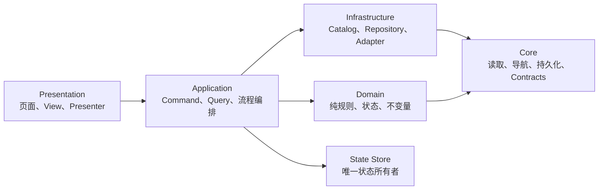

# Godot 项目基础架构规范

> 状态：基础规范 v1.0  
> 适用范围：所有 `.gd`、`.tscn`、`.tres`、运行时配置、存档、工具与测试代码。  
> 本文只规定架构，不规定任何具体业务玩法。

## 1. 规范语言

- **必须 / 禁止**：强制规则，违反时 CI 或代码审查必须阻断。
- **应该 / 不应该**：默认规则；偏离时必须说明可验证的原因。
- **可以**：允许但不强制。
- 无法遵守强制规则时，先写 ADR；禁止先实现再补理由。

本规范与 `AGENTS.md` 必须保持一致。修改公共 API、存档结构、配置格式、Autoload 或依赖方向时，应同时检查两份文件是否需要更新。

## 2. 总体原则

项目采用**模块化单体、功能优先、模块内分层**，不建设微服务式目录，也不为未来需求预建空层。



强制原则：

1. 一个脚本只有一个主要职责、一个主要变化原因。
2. 依赖只能向内：`presentation -> application -> domain/core`。
3. `core` 禁止认识任何具体功能模块。
4. UI 只渲染数据并发出用户意图，禁止直接修改游戏状态。
5. Domain 必须能脱离 SceneTree、Node、Autoload、文件系统独立运行。
6. 静态定义、长期状态、局内状态、UI 临时状态、缓存必须分开。
7. 跨模块、跨场景和持久化边界使用明确 Contract；模块内部不机械创建 DTO。
8. 优先使用 Godot 原生能力和已有代码；禁止为单一实现创建接口、工厂或 DI 容器。
9. 配置和程序不变量开发期 fail-fast；禁止构造假数据继续运行。
10. 目录迁移和业务逻辑修改分开提交。

## 3. 标准目录

以下是允许的目标结构；没有对应职责时禁止创建空目录：

```text
res://
├── project.godot
├── assets/
│   ├── textures/
│   ├── audio/
│   ├── fonts/
│   ├── shaders/
│   ├── third_party/<package>/
│   └── source/                     # 原始工程文件，目录内放 .gdignore
├── data/
│   ├── <feature>/                  # 手工维护的运行时 JSON/TRES
│   ├── generated/<feature>/        # 工具确定性生成，禁止手改
│   └── localization/               # Godot 翻译源
├── resources/
│   └── <feature>/                  # Resource schema 与 .tres 实例
├── scenes/
│   ├── app/
│   ├── shared/
│   │   ├── components/
│   │   └── overlays/
│   └── <feature>/
│       ├── pages/
│       ├── scenes/
│       ├── components/
│       └── overlays/
├── scripts/
│   ├── app/
│   │   ├── app_root.gd
│   │   └── workflows/              # 真实存在的跨功能用例
│   ├── core/
│   │   ├── config/
│   │   ├── contracts/
│   │   ├── navigation/
│   │   ├── persistence/
│   │   └── state/
│   ├── shared/
│   │   └── presentation/           # 真正被多个功能复用的 UI
│   └── <feature>/
│       ├── contracts/              # 模块公开边界
│       ├── domain/
│       ├── application/
│       ├── infrastructure/
│       └── presentation/
├── tests/
│   ├── unit/
│   ├── contract/
│   ├── integration/
│   ├── smoke/
│   └── fixtures/
├── tools/
├── ui/                             # Theme、StyleBox、字体资源
└── docs/
    └── adr/
```

### 3.1 目录规则

- 一级功能目录必须代表稳定的产品模块，不得按临时需求、页面或开发者姓名建目录。
- `core/` 只放与业务无关且被多个模块使用的基础能力。
- `shared/` 只放已经被至少两个功能实际复用的内容；禁止把尚未归类的文件丢进去。
- 功能 A 只能引用功能 B 的 `application` 公开入口或 `contracts`；禁止引用 B 的 `domain`、`infrastructure`、`presentation` 私有实现。
- 跨功能事务放 `scripts/app/workflows/`，不得让两个功能 service 相互修改状态。
- 简单功能可以只有一个 application 脚本和一个页面；出现第二种真实职责后再建立子目录。
- 禁止新增 `utils/`、`helpers/`、`misc/`、`common/` 或万能 `manager/` 目录。

## 4. 依赖规则

| 调用方 | 允许依赖 | 禁止依赖 |
| --- | --- | --- |
| `scripts/core/**` | Godot API、`core/**` | 任意 feature、UI、具体业务字段 |
| `<feature>/domain/**` | 本模块 domain、contracts、纯 core 类型 | Node、SceneTree、Autoload、FileAccess、其他 feature |
| `<feature>/infrastructure/**` | core reader/repository、本模块定义与 contract | UI、其他功能私有脚本 |
| `<feature>/application/**` | 本模块 domain/infrastructure、State Store、其他模块公开 contract/API | UI 节点、其他模块私有实现 |
| `<feature>/presentation/**` | 本模块 application/contracts、SceneManager、共享 UI | DataStore 可变状态、FileAccess、配置解析 |
| `app/workflows/**` | 多个模块公开 application API/contracts | 模块私有 domain/infrastructure |

补充规则：

- Domain 禁止通过 `/root`、`get_tree()` 或 `Engine.get_singleton()` 寻找依赖。
- Application 依赖通过构造参数或明确 setter 传入；禁止建设通用 service locator。
- 不为只有一个实现的依赖创建 interface。真实出现第二实现后再抽象。
- 禁止循环依赖。若 A 与 B 必须相互调用，应把跨模块流程提升到 workflow，或提取真正共享的 contract。
- Event 只能表示“已经发生”；命令和查询必须直接调用明确 API，禁止用全局 EventBus 做请求/响应。

标准交互链只有一条：

```text
用户输入 → View signal → Page → Application → Domain
                                      ↓
                               State Store commit
                                      ↓
Result/Snapshot → Page.render() → View
```

## 5. 脚本角色白名单

每个新 `.gd` 必须能匹配下表中的一个主要角色。无法归类说明职责尚未设计清楚。

| 文件后缀/名称 | 默认基类 | 唯一职责 | 禁止内容 |
| --- | --- | --- | --- |
| `app_root.gd` | `Node` | 启动顺序、Host 组装、绑定 SceneManager、进入首路由 | 业务算法、存档迁移、页面细节 |
| `scene_manager.gd` | `Node` | 路由、返回栈、过渡锁、场景与 payload 生命周期 | 业务准入、奖励、结算、存档 |
| `data_store.gd` | `Node` | 长期/局内状态唯一持有者、快照与原子提交 | 业务规则、静态表、UI |
| `json_reader.gd` | `RefCounted` | 读取单个 JSON、解析、报告路径明确的错误 | 认识具体配置字段、缓存业务表 |
| `*_catalog.gd` | `RefCounted` | 加载、校验、归一化、索引和缓存本模块静态定义 | 修改运行状态、创建 fallback 假数据 |
| `*_validator.gd` | `RefCounted` | 被多个入口复用的边界校验 | 自动修复数据、吞掉错误 |
| `*_def.gd` | `Resource` | 声明静态定义字段、类型和定义级校验 | 具体平衡数值、玩家状态、运行时缓存 |
| `*_state.gd` | `RefCounted` | 可序列化的长期状态结构与不变量 | 静态配置、Node、Texture、Callable |
| `*_session.gd` | `RefCounted` | 一次可恢复流程的局内状态 | UI 节点、全局状态写入 |
| `*_rules.gd` / `*_calculator.gd` | `RefCounted` | 一组内聚、确定性的纯规则或计算 | 文件 I/O、导航、全局状态 |
| `*_policy.gd` / `*_resolver.gd` / `*_selector.gd` | `RefCounted` | 一个明确的纯领域决策算法 | Node、I/O、状态提交 |
| `*_application.gd` | `RefCounted` | 本模块 command/query、事务编排、提交本模块状态 | UI、文件格式细节、其他模块私有调用 |
| `*_use_case.gd` | `RefCounted` | 一个复杂但内聚的 application 流程 | 成为所有流程的万能入口 |
| `<feature>_service.gd` | `RefCounted/Node` | 小型模块公开门面；变大后拆为 application/use_case | UI 细节、文件格式、其他模块私有实现 |
| `*_workflow.gd` | `RefCounted` | 一个真实的跨功能原子用例 | UI 细节、复制各模块内部规则 |
| `*_repository.gd` | `RefCounted` | 持久化或外部数据读写 | 业务规则、UI、schema 迁移 |
| `*_adapter.gd` | `RefCounted` | 外部格式与内部 contract 的转换 | 状态所有权、业务流程 |
| `*_migration.gd` | `RefCounted` | 单一 `N -> N+1` 确定性数据迁移 | FileAccess、UI、配置查找 |
| `enum_<name>.gd` | `RefCounted` | 被多个脚本共享的有限代码状态 | 配置内容、显示文案、可扩展数据表 |
| `*_contract.gd` | `RefCounted` | 跨模块通用 DTO、校验、序列化 | 导航、状态写入、业务副作用 |
| `*_payload.gd` | `RefCounted` | 跨场景/命令输入和自身校验 | Node、Callable、service |
| `*_snapshot.gd` | `RefCounted` | 只读查询结果 | 可变全局引用、副作用 |
| `*_result.gd` | `RefCounted` | command 执行结果 | 执行业务或状态提交 |
| `*_event.gd` | `RefCounted` | 表达已经发生的事实 | 直接调用订阅者 |
| `*_page.gd` | `Control` | 协调页面子 View、调用 application、渲染结果、请求导航 | 业务算法、状态直写、文件 I/O |
| `*_scene.gd` | `Node2D/Node3D/Control` | 协调游戏场景节点与所属 application | 跨模块规则、存档直写 |
| `*_view.gd` | `Control` | 渲染 ViewModel、采集并发出用户意图 | Autoload、导航、业务状态修改 |
| `*_panel.gd` | `Control` | 页面内部内容区域的展示与意图 | 作为导航单位、直接执行业务 |
| `*_dialog.gd` | `Control` | 展示参数并发出确认/取消/关闭意图 | 修改业务状态、自行导航/释放 |
| `*_hud.gd` | `Control/CanvasLayer` | 渲染实时快照并发出操作意图 | 决定业务结果 |
| `*_host.gd` | `Node/CanvasLayer` | 管理同一类子场景的创建、定位、显示、释放 | 业务规则、状态修改 |
| `*_presenter.gd` | `RefCounted/Node` | 复杂快照到 ViewModel/视觉事件的转换 | 决定领域结果 |
| `*_view_model_builder.gd` | `RefCounted` | 纯 Snapshot -> ViewModel 转换 | Node、状态修改、导航 |
| `*_formatter.gd` | `RefCounted` | 纯显示格式转换 | 状态修改、文件/配置读取 |
| `test_*.gd` | `RefCounted/SceneTree` | 一个规则边界或一条集成链路的可运行检查 | 复制生产实现、依赖真实用户存档 |
| `*_tool.gd` | `EditorScript/SceneTree` | 一个离线生成、迁移或检查任务 | 运行时依赖、隐藏修改业务文件 |

### 5.1 基类选择

- 只有需要 SceneTree 生命周期、输入、Timer、Tween 或 `_process()` 时才继承 `Node`。
- 纯规则、Contract、Application 和 Catalog 默认继承 `RefCounted`。
- 需要 Inspector 编辑、Godot 序列化或资源引用的静态定义使用 `Resource`。
- 场景根脚本和 Autoload 不声明 `class_name`；可复用类型、Contract、Enum、Definition 才声明。
- 一个简单页面默认只有一个根脚本；禁止机械创建 Controller + Presenter + View 三件套。

## 6. 命名规则

- 文件、目录、函数、变量、signal、路由 ID：`snake_case`。
- 类型与节点名：`PascalCase`。
- 常量：`UPPER_SNAKE_CASE`。
- 私有字段和方法以 `_` 开头。
- 布尔查询以 `is_`、`has_`、`can_` 开头。
- Command 方法使用动词：`start_session()`、`equip_item()`。
- Query 方法表达读取：`get_snapshot()`、`find_by_id()`。
- 用户意图 signal 使用 `*_requested`；已发生事件使用 `*_changed`、`*_completed`、`*_failed`。
- 中文业务词使用拼音；通用技术和游戏术语使用英文。同一概念禁止混用拼音、英文和缩写。
- 一个文件一个主要类型，文件名必须准确表达职责。
- 禁止新增 `tools.gd`、`helper.gd`、`common.gd`、`base_manager.gd` 等含义不明确的脚本。

场景后缀固定：

| 类型 | 文件名 | 根节点 |
| --- | --- | --- |
| 应用根 | `app_root.tscn` | `Node` |
| 全屏 UI 页面 | `*_page.tscn` | `Control` |
| 游戏场景 | `*_scene.tscn` | `Node2D/Node3D/Control` |
| 可复用组件 | `*_view.tscn` | `Control` |
| 页面内部区域 | `*_panel.tscn` | `Control` |
| 阻塞弹窗 | `*_dialog.tscn` | `Control` |
| 非阻塞覆盖层 | `*_overlay.tscn` | `Control/CanvasLayer` |
| 游戏 HUD | `*_hud.tscn` | `Control/CanvasLayer` |

## 7. GDScript 代码规则

### 7.1 类型和 API

- 所有 public 方法、signal 参数和返回值必须显式标注类型。
- 局部变量在类型不能从右值清晰推断时必须标注类型。
- JSON 只允许在 reader/catalog/repository/migration 边界保持 `Dictionary`；进入业务层前必须验证。
- 跨模块边界禁止返回含义不明的裸 `Dictionary`；使用具名 payload/snapshot/result。
- 内部两个简单参数直接传递，禁止为了统一形式创建 DTO。
- 稳定、可扩展内容使用字符串 ID；有限且由代码定义的状态使用 enum。
- 功能私有 enum 放在该功能 `domain/`；真正跨模块的 enum 放 `core/contracts/`；仅一个 UI 脚本使用的 enum 留在该脚本内。
- 显示文本禁止作为 ID、存档键、分支条件或资源索引。
- 已知项目类型禁止使用 `has_method()`、`has_signal()`、`call()` 绕过类型检查；仅外部适配和迁移边界可以使用。

### 7.2 函数和职责

- `_ready()` 只连接节点信号、初始化展示和启动明确的页面生命周期。
- `_process()` 只用于确实需要每帧更新的模拟或视觉；普通 UI 刷新使用 signal、Timer 或显式 `render()`。
- `render()` 必须幂等：重复传入同一 ViewModel 得到相同界面。
- 随机规则必须允许注入 seed/RNG，保证测试可复现。
- 时间相关规则必须允许注入时间值；禁止 Domain 直接读取系统时间。
- 固定输入使用 InputMap action；除开发调试入口外禁止硬编码 keycode。
- 禁止用 `call_deferred()` 掩盖错误的依赖或初始化顺序。
- 禁止复制 Godot 原生已有能力，优先使用 ResourceLoader、SceneTree、Container、Theme、Tween、Timer、TranslationServer。

### 7.3 复杂度审查

不设机械行数上限。满足任一条件时必须做职责拆分审查：

- 脚本有两个以上互不相关的修改原因。
- 同时操作 UI、文件和业务状态。
- 同时拥有状态、规则、持久化和展示中的两类以上职责。
- public API 多到无法用一句话描述脚本职责。
- 文件只能被命名为 `manager`、`service`、`tools` 才能容纳现有功能。

行数只能作为提示，不得为了变短制造一批只转发一次的小文件。

## 8. 状态规则

| 状态类型 | 所有者 | 是否持久化 | 规则 |
| --- | --- | ---: | --- |
| 静态定义 | Feature Catalog | 否 | 加载后只读，不进入运行态 |
| 长期状态 | Data Store + 对应 Application | 是 | 通过 command 原子提交 |
| Session 状态 | 对应 Feature Application | 按恢复需求决定 | 只含可序列化数据 |
| UI 临时状态 | Page/View | 否 | 选中项、滚动、开关等局部展示态 |
| Cache | Catalog/Repository | 否 | 可随时删除并重建 |

强制规则：

- Data Store 是长期状态和跨场景 session 状态的唯一持有者。
- Data Store 禁止向外公开 `savedata/rundata` 可变 Dictionary。
- Query 返回只读 Contract 或深拷贝快照。
- 每个功能只有对应 Application 可以提交该功能状态切片。
- 跨功能操作由 workflow 在 working copy 上完成全部验证，成功后一次提交。
- 失败操作必须保证状态不变；禁止先扣资源再发现后续步骤失败。
- UI 临时状态不得写入全局状态或存档。
- 状态中禁止保存 Node、Resource 实例、Texture、Callable、RID、绝对路径或 service 实例。
- Scene payload 只含值、稳定 ID、Array、Dictionary 或 Contract；消费后由 SceneManager 删除。
- 随机 session 保存必要 seed/RNG 状态，确保问题可复现。

不引入通用事务框架；只有真实的跨模块原子操作才使用 working-copy 提交。

## 9. 静态配置规则

配置链固定为：

```text
JsonReader / ResourceLoader
        ↓
FeatureCatalog：校验、归一化、索引
        ↓
Typed Definition / 只读 Snapshot
        ↓
Domain / Application
```

Catalog 必须：

1. 按需读取本模块所需的单个文件，禁止启动时遍历并加载整个 `data/`。
2. 检查语法、根类型、必填字段、字段类型、ID 唯一性与引用完整性。
3. 报错包含文件路径、字段路径、非法值和稳定错误码。
4. 加载后配置不可变；不得把内部缓存的可变引用交给调用方。
5. 缺文件、重复 ID、失效引用立即失败；禁止制造默认敌人、默认技能或空规则继续运行。
6. Reload 只允许在 Editor/GM 明确入口触发，正常运行期间配置视为不可变。

格式规则：

- `.json`：外部表格、批量数据和工具导出。
- `.tres`：需要 Inspector 编辑、Godot Resource 或资源引用的数据。
- `resources/**/*_def.gd`：只声明 Resource schema 和校验，不存具体数值表。
- YAML 只能作为离线编辑源，运行时禁止读取；必须先确定性转换为 JSON/TRES。
- 同一数据族只能有一个权威源。生成 JSON 必须放 `data/generated/`，禁止手改。
- 生成工具必须排序稳定、可重复执行，不写入时间戳等无意义 diff。
- 玩家可见 UI 文案使用 Godot Translation/`tr()`；显示文案不能承担业务 ID。

脚本常量只允许：enum、InputMap action 名、signal 名、所属模块固定的 `res://` 技术路径、内部行为阈值和固定技术参数。业务名称、描述、数值表、掉落、价格、对话、任务、配方等静态数据禁止写入 `.gd`。

## 10. 文件与资源存储规则

### 10.1 `res://`

- `assets/` 只存运行时资产；源工程文件放 `assets/source/` 并使用 `.gdignore` 避免 Godot 导入。
- 第三方资产放 `assets/third_party/<package>/`，必须包含来源和 LICENSE。
- 运行时禁止写入 `res://`。
- `.tscn`、`.tres` 使用文本格式，禁止无必要的二进制 `.scn/.res`。
- 所有运行时路径使用 `res://`，禁止绝对磁盘路径。
- 资源移动必须由 Godot Editor 或可验证脚本完成，并执行失效引用检查。

### 10.2 `user://`

```text
user://
├── saves/
│   └── slot_<id>/
│       ├── save.json
│       ├── save.bak
│       └── save.tmp
├── settings.json
├── logs/
└── cache/
```

- 存档、设置、日志、缓存必须分开。
- Cache 可随时删除，禁止成为唯一数据来源。
- Settings 不进入存档槽；删除存档不得清除用户设置。
- 文件名和路径禁止直接拼接未经清理的用户输入。
- Token、密钥和凭证禁止进入项目仓库或普通存档；使用 CI Secret 或平台安全存储。

### 10.3 Git

必须提交：

- `.gd`、Godot 生成的 `.gd.uid`、`.tscn`、`.tres`。
- 运行必需资产、Theme、配置与确定性生成产物。
- 生成工具和第三方 LICENSE。

必须忽略：

- `.godot/`、`user://` 内容、日志、缓存和临时文件。
- 导出包、本机编辑器设置、本机表格副本、`.env` 和任何密钥。

孤立 `.gd.uid`、失效脚本引用和缺失资源必须使 CI 失败。UID 禁止手工编辑。

## 11. 存档规则

存档信封至少包含：

```json
{
  "schema_version": 1,
  "app_version": "x.y.z",
  "saved_at_unix": 0,
  "slot_id": 1,
  "payload": {}
}
```

### 11.1 写入流程

1. 获取当前状态深拷贝。
2. 完整校验当前 schema。
3. 写入 `save.tmp` 并关闭文件。
4. 重新读取并验证临时文件。
5. 将当前主存档保留为 `save.bak`。
6. 原子替换 `save.json`。
7. 任一步失败时保留旧存档并返回明确错误。

### 11.2 读取与迁移

1. 校验信封和 payload，拒绝高于当前版本的存档。
2. 旧存档按连续的 `N -> N+1` migration 顺序升级。
3. Migration 必须是纯函数、确定性、无 FileAccess、无 UI、无配置依赖。
4. 最终 schema 验证通过后才提交 Data Store。
5. 主存档损坏时可以尝试 `.bak`，但必须明确报告使用了备份。

禁止在 getter、service、UI 或 `.get(default)` 中分散模拟迁移。只有存在旧版本兼容需求时才创建 migration；不为假设中的未来版本预建迁移框架。

## 12. Godot 运行时与 Autoload

### 12.1 最小根结构

```text
AppRoot (Node，唯一 main_scene，常驻)
├── SceneHost (Node)                 # 一个活动可导航场景
├── ModalLayer (CanvasLayer)
│   └── ModalHost (Control)
├── TransientLayer (CanvasLayer)
│   ├── ToastHost
│   └── TooltipHost
└── TransitionLayer (CanvasLayer)    # 过渡/加载遮罩和重复输入阻断
```

- `AppRoot` 只组合 Host、绑定 SceneManager、验证启动条件并进入初始路由。
- 全局 CanvasLayer 层级只在 `app_root.tscn` 设置，功能脚本禁止自行争抢全局 layer/z_index。
- 功能节点禁止直接添加到 `get_tree().root`。
- Toast、Tooltip、Dialog、GM 等由 AppRoot 的 Host 组合，禁止每种浮层建立一个 Autoload。

### 12.2 Autoload 准入

只有同时满足以下条件的脚本才可成为 Autoload：

1. 生命周期确实覆盖整个应用。
2. 全局唯一且职责可以用一句话描述。
3. 不属于单个功能页面或 session。
4. 不可由 AppRoot 子节点更自然地持有。
5. 新增已通过 ADR 和代码审查。

基线允许的全局职责只有：状态存储、只读配置入口、场景导航。业务功能 service、页面、弹窗、剧情流程、一次战斗/任务 session 禁止成为 Autoload。

Autoload `_ready()` 禁止批量加载全项目配置或启动业务流程；启动顺序由 AppRoot 明确编排。

## 13. 场景和页面设计规则

### 13.1 场景分类

- Page：全屏可导航 UI，必须登记路由。
- Game Scene：可导航的 Node2D/Node3D/Control 游戏场景，HUD 作为子场景。
- Panel：页面内部视觉区域，不是导航单位。
- View/Component：可复用展示单元，只渲染和发出意图。
- Dialog：阻塞弹窗，只通过 ModalHost 打开。
- Overlay：非阻塞提示、Tooltip、Toast、浮字。
- HUD：由所属 Game Scene 持有，不独立导航。

禁止把同一 `.tscn` 同时当 Page、Dialog 和嵌入式 Component 使用。

### 13.2 固定与动态 UI

- 固定节点、布局、锚点、Theme 和静态资源写在 `.tscn`；信号连接统一放在场景根脚本 `_ready()`，便于检索。
- 脚本只做数据绑定、局部展示状态、动画和 signal 转发。
- 数据决定数量的重复项使用一个预制 item/view 场景，运行时实例化到静态 Container。
- 地图连线、战斗浮字、程序化绘制等天然动态节点可以由代码创建。
- 高频列表按稳定 ID 更新已有节点；没有性能证据时不建设对象池和虚拟列表。
- 禁止用 `Button.new()`、`Label.new()` 等创建本来固定的页面结构。
- 禁止每帧清空并重建列表。

### 13.3 节点引用

- 脚本访问的固定节点必须设置 `unique_name_in_owner = true`。
- 使用带类型的 `%NodeName`：

```gdscript
@onready var _confirm_button: Button = %ConfirmButton
```

- 动态节点在 `instantiate()` 后保存直接引用。
- 禁止 `$A/B/C`、`get_node("A/B")`、`find_child()`、`../..`。
- 必需固定节点缺失时开发期直接失败，禁止用 `get_node_or_null()` 掩盖损坏的场景结构。
- NodePath 常量只允许引擎或第三方 API 无法替代的情况，并必须注释原因。

### 13.4 页面生命周期

```text
验证 route/payload
→ load + instantiate
→ 可选 setup(payload)，只保存参数
→ add_child
→ _ready：连接节点、首次 render
→ active
→ queue_free
→ _exit_tree：取消长任务和外部订阅
```

- 页面离开必须 `queue_free()`，默认不缓存隐藏页面实例。
- 页面数据源是状态快照，不得把 Node 树当业务状态保存。
- 页面销毁后，任何长生命周期对象禁止继续持有其 Node 引用。
- 超过一帧的 `await` 恢复后，访问节点前必须检查 `is_inside_tree()`；并使用 token/cancellation 防止旧请求覆盖新页面。
- `_exit_tree()` 只清理跨场景/长生命周期订阅和异步任务；Godot 会自动清理普通子节点和失效 signal 连接。
- 禁止页面退出后继续更新 UI。

## 14. SceneManager 规则

SceneManager 只负责：

- route ID 到 PackedScene/path 的唯一注册表。
- 活动场景、返回栈和过渡锁。
- payload 边界校验与一次性交付。
- 加载、实例化、原子替换和释放旧场景。
- 导航成功/失败信号。

导航必须按以下顺序执行：

1. 校验 route 和 payload。
2. 获取过渡锁；重复请求返回明确的 `transition_in_progress`。
3. 成功加载并实例化新场景。
4. 将新场景加入 SceneHost。
5. 更新活动路由和返回栈。
6. 释放旧场景和过渡锁。

任一步失败都必须保留旧页面可用。空闲状态下 SceneHost 必须只有一个活动可导航场景。

禁止：

- 功能脚本调用 `change_scene_to_file()`。
- 页面自行实例化另一个全屏 Page。
- 在多个脚本散落可导航场景路径。
- 导航成功前销毁当前页面或修改历史。
- 把业务准入、结算、奖励和存档写入 SceneManager。
- 为每个 route 建立只有一行转发的 `go_xxx()`；只有真实参数组装/校验时才允许 helper。

## 15. UI、弹窗与输入规则

### 15.1 UI 边界

- Page 调用 Application command/query，收到 Result/Snapshot 后完整 render。
- View 只接收 ViewModel 并发出语义化 signal；可复用 View 禁止访问 Autoload 或发起导航。
- Presenter 只有在转换复杂或被多个页面复用时才创建。
- Dialog 只展示数据并发出 `confirm_requested`、`cancel_requested`、`close_requested`；由 Host 关闭和释放。
- Host 只管理同类临时 UI 生命周期，不执行业务。
- UI 禁止计算奖励、价格、伤害、成功率或其他领域规则。

### 15.2 信号

- 子节点向父节点发意图，父节点调用子节点 public 方法向下更新。
- 固定节点 signal 在根脚本 `_ready()` 连接；动态节点在创建处连接。
- 同一 signal 禁止同时在 `.tscn` 和代码重复连接。
- 需要显式断开的长期连接使用命名方法，避免不可追踪的匿名 lambda。
- 子节点禁止通过 `get_parent()` 调父级业务方法。
- 同一页面父子通信禁止经过全局 EventBus。

### 15.3 Dialog

阻塞弹窗统一结构：

```text
DialogRoot (Control, Full Rect)
├── Dimmer (ColorRect, Full Rect, Mouse Filter Stop)
└── CenterContainer
    └── PanelContainer
        └── Content
```

- 默认只允许一个阻塞 Dialog；有真实嵌套需求后再引入栈。
- 打开时保存原焦点并聚焦默认控件，关闭时恢复焦点。
- Dimmer 必须阻止鼠标穿透；键盘/手柄焦点不得落到底层页面。
- `ui_cancel` 只关闭当前允许取消的最上层 Dialog。
- 是否暂停游戏模拟由具体 application 决定，Dialog 禁止直接修改 `get_tree().paused`。
- Toast、Tooltip 和浮字必须 `mouse_filter = IGNORE`。

### 15.4 响应式与可访问性

- 全屏 Control 使用 Full Rect。
- 常规 UI 使用 Container、anchors、size flags 和 minimum size；禁止整页依赖绝对 offset。
- 长内容使用自动换行或 ScrollContainer。
- 装饰节点使用 `mouse_filter = IGNORE`。
- 所有主要操作必须支持键盘/手柄焦点；可点击目标建议至少 44×44 逻辑像素。
- 禁止只通过颜色表达状态；文本、图标或形状必须提供第二种提示。
- 页面至少验证设计分辨率、最窄目标比例和最宽目标比例。
- 地图/游戏画布可以使用绝对坐标，但必须与响应式 UI 框架隔离。
- 玩家可见文本使用 Theme 和翻译资源，禁止在业务脚本散落硬编码文案。

### 15.5 输入

- GUI 操作使用 Button/Control signal。
- 快捷键使用 InputMap action。
- 页面级输入使用 `_unhandled_input()`；处理后调用 `set_input_as_handled()`。
- 功能页面禁止用 `_input()` 抢先截获全部输入。
- 菜单按钮禁止在 `_process()` 轮询 `Input.is_action_pressed()`。
- 原始 keycode 只允许开发调试入口，并必须集中管理。

## 16. 错误、日志和资源生命周期

### 16.1 错误处理

- 用户输入、I/O、存档、配置和 scene payload 等信任边界必须完整校验。
- 可恢复错误返回具名 Result，包含稳定 `error_code` 和可展示 message。
- 程序员不变量可以使用 `assert`；不能用 assert 替代外部输入校验。
- 开发/CI 中配置和资源错误必须 fail-fast。
- Release 可以显示明确的致命错误页面，但禁止构造假配置继续运行。
- 禁止用 `{}`、`null`、`false` 静默表示多种失败原因。

### 16.2 日志

- 使用 Godot 原生 `push_error()`、`push_warning()`；普通调试输出必须可关闭。
- 日志必须包含模块、动作、稳定 ID/route 和错误码，不记录密钥或完整敏感存档。
- 禁止为尚不存在的遥测需求建立复杂 Logger；真实需要上报时再加 adapter。

### 16.3 资源和性能

- UI 树只能在主线程修改。
- Timer、Tween 和临时 Node 由所属场景创建并随 owner 释放。
- 页面和大型低频资源按需 `load()`；当前场景必用的小型稳定资源可以 `preload()`。
- 只有性能测量证明需要后才使用 threaded load、对象池、页面缓存或复杂虚拟化。
- 禁止 Autoload 持有已经释放或即将离开的页面 Node。
- 禁止无持续动画/实时视觉需求的 UI 常驻 `_process()`。

## 17. Contract 规则

只有以下边界建立 Contract：

- 跨功能模块。
- 跨场景。
- 存档序列化和 migration。
- 后台/异步任务。
- UI 需要稳定只读快照。
- 外部工具输入输出。

Contract 必须：

- 只保存数据，字段类型明确。
- 自带边界校验。
- 需要序列化时集中提供 `to_dict()/from_dict()`。
- 禁止保存 Node、Callable、service 或可变全局引用。
- 禁止执行导航、结算、状态提交等副作用。
- 由生产该 Contract 的模块拥有。

禁止创建万能 Result/DTO 基类或给所有内部函数套 Command 对象。

## 18. 测试规则

测试层级固定为四类：

| 类型 | 目标 | 不测试 |
| --- | --- | --- |
| Unit | 纯 Domain 规则、不变量、边界与随机 seed | getter/setter、Godot 原生行为 |
| Contract | 配置、payload、result、存档 schema、引用完整性 | 内部私有实现 |
| Integration | Application + State Store + Repository 的状态提交/失败回滚 | 完整生产数据副本 |
| Smoke | 启动、全部 route 场景实例化、关键 Dialog/输入链路 | 像素级美术验收 |

强制规则：

- 每个新增或修改的非平凡分支、循环、解析器、存档路径必须至少留下一个可运行检查。
- 每个修复过的非平凡 bug 必须留下最小回归测试。
- 随机逻辑注入 seed；时间逻辑注入时间值。
- Fixture 只包含触发目标行为所需的最小数据，禁止复制完整生产配置。
- 测试禁止读取或覆盖真实 `user://` 存档。
- 测试失败必须返回非零退出码。

## 19. 单一验证入口

本地和 CI 必须调用同一个入口：

```text
npm run validate
```

该入口按顺序执行：

1. 所有配置 schema/reference validator。
2. 架构静态检查。
3. 孤立 UID、缺失脚本和资源引用检查。
4. Godot unit/contract/integration tests。
5. 遍历所有 route 的 scene smoke。
6. Godot headless 启动，输出不得包含 ERROR。
7. `git diff --check`。

静态检查至少阻断：

| ID | 检查 |
| --- | --- |
| `ARCH-001` | `scripts/core/**` 引用任意 feature |
| `ARCH-002` | presentation 使用 DataStore、FileAccess 或 `user://` |
| `ARCH-003` | 任意脚本直接访问 Data Store 内部可变字典 |
| `ARCH-004` | 跨 feature 引用目标模块私有目录 |
| `ARCH-005` | domain 继承 Node 或引用 SceneTree/Autoload |
| `ARCH-006` | 固定 UI 脚本动态创建 Control，且不在明确白名单 |
| `ARCH-007` | orphan UID、缺失脚本或失效资源引用 |
| `ARCH-008` | route 未登记、重复登记、路径不存在或无法实例化 |
| `DATA-001` | 运行时脚本读取 YAML/源数据或静态业务表写入 `.gd` |
| `SAVE-001` | schema 与 migration 链不连续 |

静态检查只检查确定性边界。单一职责、命名是否准确等需要代码审查判断，不用复杂正则假装自动化。

误报通过一个小型 allowlist 管理，条目必须包含：规则 ID、路径、原因、责任人/模块和删除条件；禁止散落 `ignore` 注释或全局关闭规则。

## 20. 架构变更与 ADR

仅以下变化需要 ADR：

- 新增 Autoload 或全局长期生命周期服务。
- 改变依赖方向或模块公开边界。
- 引入新的持久化格式、网络层、线程模型或第三方框架。
- 新增跨模块 shared 能力。
- 对强制架构规则建立长期例外。

ADR 路径：`docs/adr/NNNN_<short_title>.md`，只需记录问题、决定、替代方案和后果。普通 bug 修复、页面开发和内部重构不写 ADR。

## 21. 公共 API 与版本规则

- Public 方法、signal、`class_name`、Resource 字段和 route ID 视为公共 API。
- 改名或删除前必须列出全部调用方、场景引用、存档/配置影响和迁移步骤。
- 存档字段变化必须提升 `schema_version` 并提供连续 migration。
- 配置格式变化必须同步 validator、生成工具和最小 fixture。
- Scene payload 变化必须同步其 Contract 和 smoke/contract test。
- 兼容只保留一个明确迁移窗口；确认仓库调用为 0 后删除，禁止永久累积 fallback。

## 22. Definition of Done

任何功能、页面或重构完成前必须确认：

1. 每个新增脚本都能归入一个明确角色。
2. 依赖方向和模块公开边界没有被破坏。
3. 静态数据、长期状态、session、UI 状态位置正确。
4. UI 固定结构在 `.tscn`，且只通过 application 修改业务状态。
5. 路由、payload、signal、公共 API 或 schema 变更已列迁移影响。
6. 新增的非平凡逻辑有最小可运行检查。
7. `npm run validate` 全绿，Godot headless 无 ERROR。
8. 修改前已列计划文件，修改后已汇总所有变更文件。

## 23. 默认禁止建设

除非出现可测量、已存在的需求，否则禁止引入：

- DI 容器或 service locator。
- 每个类一套 interface/repository/factory。
- 全局字符串 EventBus。
- CQRS、事件溯源、插件式模块系统。
- 通用事务框架。
- 万能 BasePage/BaseService/BaseManager。
- 默认页面缓存、对象池、threaded loading。
- 每个功能一个 Autoload。
- 为所有函数创建 command/result/DTO。
- “以后可能用到”的扩展点、配置开关和空目录。

最小的、能通过边界检查和测试的实现，就是默认正确实现。
