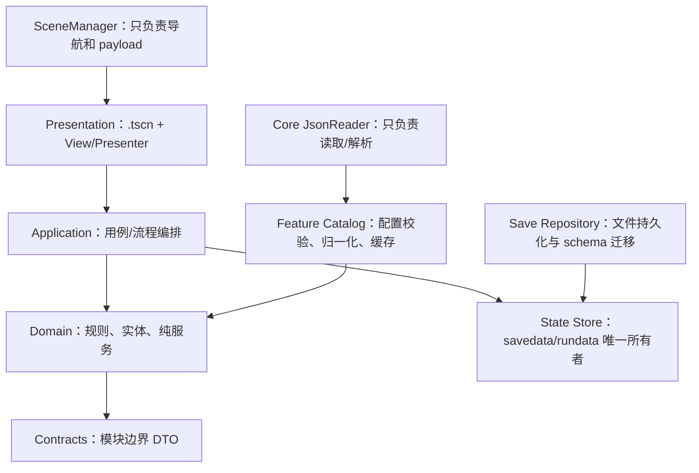

# 项目重构架构设计

> 扫描基线：2026-07-10。本文只设计重构，不修改现有业务行为。仓库当前存在未提交改动，实施前应先形成独立基线提交，避免把功能开发与架构迁移混在一起。

## 1. 结论

项目不需要推倒重写。已有战斗、历练、地图、剧情和配置服务具备可复用基础，主要问题是边界没有被强制执行：全局状态承担过多业务、核心层反向依赖功能层、UI 可直接接触可变状态、配置读取和兼容逻辑分散。

重构采用“稳定门面 + 纵向切片”的渐进方案：

1. 先修复验证基线，保证每次改动可判定是否破坏功能。
2. 保留 `GameState`、`ConfigManager`、`LilianState` 现有公共方法作为临时兼容门面。
3. 按修炼、炼丹、突破、背包、委托、历练、战斗逐模块抽离状态与用例。
4. UI 只发命令和渲染快照，不直接修改游戏状态。
5. 最后删除门面中的转发代码和无效兼容层，不做无收益的纯目录搬家。

## 2. 当前项目基线

| 范围 | 数量/规模 | 观察 |
| --- | ---: | --- |
| GDScript | 221 个，42,544 行，2,844 个函数 | 597 个函数返回 `Dictionary`，跨模块契约偏弱 |
| 场景 | 85 个 | 612 个 `unique_name_in_owner`，节点引用约定执行良好 |
| JSON 配置 | 80 个 | 配置已外置，但加载、归一化和默认降级职责混杂 |
| Autoload | 13 个 | 状态、UI Host、剧情和功能服务均全局化 |
| 战斗模块 | 55 文件，10,803 行 | 最大模块，已有 domain/scene/vfx/ai 子结构 |
| UI 模块 | 53 文件，8,576 行 | 仍有 6 个脚本动态创建固定 UI 节点 |
| 模拟模块 | 25 文件，7,171 行 | `GameState` 成为事实上的上帝对象 |
| 历练模块 | 17 文件，4,377 行 | `LilianState` 同时持有状态、流程和跨场景编排 |

最大职责聚集点：

| 文件 | 行数 | 当前职责 |
| --- | ---: | --- |
| `scripts/sim/game_state.gd` | 1,748 | 存档门面、新游戏、修炼、炼丹、突破、地图、奖励、时间、战斗快照、装备与物品 |
| `scripts/zhandou/zhandou_domain_service.gd` | 1,204 | 战斗时序、技能/物品/装备、资源、效果路由与事件 |
| `scripts/zhandou/zhandou_init_data.gd` | 1,136 | 战斗输入装配、配置合并、图标解析、旧结构降级 |
| `scripts/zhandou/zhandou_obj.gd` | 1,096 | 战斗单位状态、冷却、效果、费用、事件与查询 |
| `scripts/lilian/lilian_state.gd` | 1,045 | 局内状态、地图推进、事件、战斗衔接、结算、日志和背包 |
| `scripts/core/config_manager.gd` | 824 | 物品、技能、装备、Buff、怪物、地点、地图、历练事件与规则缓存 |
| `scripts/core/json_loader.gd` | 751 | 文件读取、导出格式解析、各功能配置装配与部分业务归一化 |
| `scenes/items/bag_base.gd` | 793 | 虚拟列表、筛选、排序、数据转换、悬浮提示与物品/装备解释 |

## 3. 当前主要风险

### P0：验证基线不可用

- `node tools/validate-all.mjs` 当前失败：大道树 37 项、技能 8 项，修炼功法校验器在 `prev.effects.find` 处抛出类型异常。
- Godot 4.6.2 headless 启动能进入主场景，但报告 4 个缺失历练配置文件：`lilian_common_events*.json`、`lilian_events*.json`。
- 4 个 `.gd.uid` 没有对应脚本：`battle_summary.gd`、两个旧战斗 enum、`combat_block_presenter.gd`。
- `npm run validate` 受本机 PowerShell 执行策略影响；CI 和本地入口应直接调用 `node tools/validate-all.mjs`，或使用可执行的 `.cmd`/PowerShell 包装。

在基线变绿前开始大规模重构，会无法区分“旧问题”和“新回归”。

### P1：状态所有权不唯一

`DataStore.savedata` 是实际数据源，`GameState` 通过大量 getter/setter 暴露同一字典，多个 service 又接收并原地修改该字典；剧情、教程和委托仍直接写 `DataStore.savedata`。因此目前没有单一写入口，也无法可靠记录一次业务操作改变了哪些字段。

### P1：依赖方向倒置

当前 `core` 直接依赖 `sim`、`dao`、`lilian`、`map`、`zhandou`。例如 `DataStore` preload 角色、知识和炼丹服务，`ConfigManager` 认识所有功能配置与战斗定义。核心层无法独立启动或测试，任一功能配置错误都会污染全局启动。

### P1：UI 与业务耦合

UI 大量读取 `GameState`，部分 UI 直接调用会改变状态的 service；`ItemInfoPopupHost` 甚至执行物品使用。`bag_base.gd` 同时把库存模型转成显示模型。固定 UI 仍在 6 个脚本中动态创建，不符合项目的 `.tscn` 约定。

### P2：跨模块契约以 Dictionary 为主

现有 `ScenePayload`、`LilianResult`、`PlayerBattleSnapshot`、`ZhandouSummary` 是正确方向，但大量关键边界仍依赖隐式字符串键。配置、场景、战斗和结算之间的错误通常只能在运行到具体分支后发现。

### P2：兼容和降级逻辑持续扩散

旧字段映射、默认配置、fallback 战斗配置和静默空字典分布在 loader、enum、service 与 UI 中。这与项目“开发阶段非法数据直接报错”的约定冲突，也让真实配置错误在更远处才暴露。

## 4. 目标架构



依赖只能向下：

`presentation -> application -> domain -> core contracts`

`feature catalog -> generic json reader`

禁止：

- `core -> feature`
- `domain -> UI/SceneTree/autoload`
- `UI -> DataStore.savedata`
- 功能 A 直接修改功能 B 的状态切片
- loader 对缺失业务配置构造“可运行的假数据”

## 5. 模块职责

| 模块 | 唯一职责 | 可依赖 | 不允许 |
| --- | --- | --- | --- |
| `core/state` | 保存 savedata/rundata、schema 版本、导入导出 | contracts | 业务计算、UI、功能 service |
| `core/config` | 通用 JSON 读取与格式错误报告 | Godot FileAccess/JSON | 知道物品、战斗、历练字段 |
| `core/navigation` | 场景注册、切换、返回栈、payload | SceneTree、contracts | 结算与业务状态修改 |
| `sim/*` | 玩家长期状态的垂直功能：时间、修炼、炼丹、突破、库存、委托 | core、各自 catalog | UI 节点、跨功能原地写状态 |
| `lilian` | 一次历练 session、事件、地图与结算用例 | sim 的公开命令、battle contracts | 直接写玩家长期状态 |
| `zhandou` | 一次战斗 session、规则、AI、记录和 VFX 事件 | battle catalog、contracts | 读取全局 GameState 或 LilianState |
| `map` | 世界图查询、寻路、旅行用例 | map catalog、time command | 直接推进玩家其他状态 |
| `story` | 剧情状态机和教程触发 | story catalog、application events | 直接写任意 savedata 字段 |
| `ui` | 渲染 ViewModel、发出用户意图 | application API | 业务规则、配置归一化、状态写入 |

## 6. 状态与命令模型

### 长期状态

`DataStore.savedata` 保持唯一持有者，但不再公开可变引用。对外只返回深拷贝快照。长期状态按功能键分区：

```text
savedata
├── profile / progression / vitals
├── inventory / equipment
├── cultivation / knowledge / alchemy
├── map / commissions
└── story / tutorial / statistics
```

每个功能只有一个 application service 可以提交本功能状态。跨功能操作由用例编排，例如“炼丹”按顺序调用库存扣除、炼丹结算、时间推进，再统一产生结果和事件。

### 局内状态

`rundata` 只存可恢复的 session 数据，不保存 Node、Texture、Callable 或 service 实例：

- `lilian_session`
- `battle_session`
- `scene_payloads`
- `ui_transient`

`LilianState` 迁移后变为 `LilianSessionService`，以 session 字典为输入并返回新 session/结果；战斗场景只消费 `BattleInit`，只返回 `ZhandouSummary`。

### 业务操作返回值

跨模块操作统一返回明确 contract，至少包含：

```text
ok, error_code, message, state_changes, events, payload
```

不要为所有内部函数创建 DTO；只在存档、场景、战斗、历练结算、奖励和公共命令边界使用 typed contract。

## 7. 建议目录

保持现有顶层结构，按触碰到的功能逐步整理，不进行一次性移动：

```text
scripts/
├── core/
│   ├── state/          # data_store、schema、migration
│   ├── config/         # json_reader、通用校验工具
│   ├── navigation/     # scene_manager
│   └── contracts/      # 跨模块 DTO
├── sim/
│   ├── player/
│   ├── inventory/
│   ├── cultivation/
│   ├── alchemy/
│   ├── breakthrough/
│   ├── commission/
│   └── time/
├── lilian/
│   ├── domain/
│   ├── application/
│   └── presentation/
├── zhandou/
│   ├── domain/
│   ├── application/
│   ├── ai/
│   ├── vfx/
│   └── presentation/
├── map/
├── story/
└── ui/
    ├── shared/
    └── overlays/
```

场景继续放在 `scenes/<feature>/`。固定控件、样式和布局必须在 `.tscn`；脚本只绑定数据、状态和信号。纯绘图或运行时数量不定的节点（地图连线、战斗浮字等）可保留动态创建。

## 8. Autoload 收敛

目标从 13 个降到 4 个全局入口：

| 保留/目标 | 职责 |
| --- | --- |
| `DataStore` | 纯状态容器与 schema，不含业务规则 |
| `ConfigCatalog` | 只读配置入口；内部按功能延迟加载 catalog |
| `SceneManager` | 导航与 typed payload |
| `UiOverlayHost` | 一个 `.tscn` 组合 tips、hover、item popup 和开发期 GM 子场景 |

迁移期保留 `GameState`、`LilianState`、`DataEvents` 作为兼容入口。`SaveService` 改为由存档用例持有；`StoryDirector`、`TutorialService` 由应用根或剧情模块场景持有；各 UI Host 变为 `UiOverlayHost` 的子节点而非 autoload。

## 9. 关键文件拆分

### `game_state.gd`

先保持所有公开方法签名不变，仅把实现委托给现有/新增功能 service：

| 当前方法组 | 目标服务 |
| --- | --- |
| `save_game/load_game/to_dict/apply_dict` | `GameSaveApplication` |
| `cultivate*`、`preview_cultivation*` | `CultivationApplication` |
| `liandan*`、`brew*` | `AlchemyApplication` |
| `preview_breakthrough/attempt_breakthrough` | `BreakthroughApplication` |
| `travel_to_city/map_data` | `WorldTravelApplication` |
| `use_inventory_item/assign_*_slot` | `InventoryApplication`、`LoadoutApplication` |
| `begin_lilian/settle_lilian` | `LilianApplication` |
| `build_battle_*` | `BattleGateway` |
| `_advance_time` | `GameTimeApplication` |

完成后 `GameState` 只剩兼容转发；调用方迁完再删除，而不是同时改几十个 UI。

### `config_manager.gd` 与 `json_loader.gd`

`JsonLoader` 缩为通用 `JsonReader`：读取文件、解析 JSON、去注释、报告路径和错误。物品、战斗、地图、历练等 load/normalize/cache 分别迁到功能 catalog。`ConfigManager` 暂时转发旧查询，所有新代码直接依赖对应 catalog。

### `lilian_state.gd`

拆为三部分：

- `LilianSession`：只保存局内数据并负责序列化。
- `LilianApplication`：start/advance/choose/finish 用例。
- 现有 event/map/reward/log service：保留纯规则，清除 autoload 查找。

历练与战斗只通过 `BattleInit`、`ZhandouSummary` 交换数据。

### 战斗大文件

战斗已有合理子模块，不做全面重写。优先把 `zhandou_domain_service.gd` 的“时序推进”“行动执行”“效果应用”拆成三个内部协作者；`zhandou_obj.gd` 只保留单位状态和不变量；`zhandou_init_data.gd` 删除运行时 fallback builder，要求 catalog 在进入战斗前完成校验。

### UI

`bag_base.gd` 保留虚拟列表和交互，把库存/装备到行数据的转换迁到 `InventoryViewModelBuilder`。以下固定 UI 创建迁回 `.tscn`：

- `gm_battle_panel.gd`
- `dao_tree_panel.gd`
- `weituo_board_panel.gd`
- `bag_base.gd`
- `peizhi_xuanze_tanchuang.gd`

`dao_tree_graph_view.gd` 的图节点和连线数量由数据决定，可继续动态生成。

## 10. 公共 API 迁移影响

第一至第三阶段禁止直接删除或改名以下入口：

- `GameState.*`
- `LilianState.*`
- `ConfigManager.*`
- `SceneManager.SCENE_PATHS`、`SceneManager.go_to()` 及现有 helper
- `DataEvents` 现有 signals
- 存档字段、scene payload 字段、战斗/历练 summary 字段

迁移规则：旧入口调用新实现并输出一次开发期 deprecation warning；当 `rg` 确认仓库内调用为 0、存档迁移和 contract tests 均通过后，才在独立提交中删除。存档字段变更必须提升 schema version 并提供单向 migration，不能用散落的 `.get(default)` 模拟迁移。

## 11. 实施阶段

### Phase 0：稳定基线

- 修复三类 Node 配置校验失败和校验器类型异常。
- 明确缺失历练 JSON 是删除、改名还是导出遗漏；loader 不再静默继续。
- 删除 4 个孤立 `.uid` 或恢复对应脚本。
- 增加单一验证入口，保证本地和 CI 同命令。
- 记录当前可用场景的 smoke baseline。

完成标准：配置校验退出码 0；Godot headless 启动无 ERROR；主菜单、洞府、地图、历练、战斗最小链路可打开。

### Phase 1：建立边界，不改行为

- 给 `core` 移除功能层 preload；先迁 feature-specific config loader。
- 定义状态写入清单，阻止新增 `DataStore.savedata` 直接写入。
- 补齐 `BattleInit`、`ZhandouSummary`、`LilianResult` 的边界校验。
- 为现有门面添加委托点，不改调用方。

完成标准：`core -> feature` 静态依赖为 0；新增代码符合依赖规则。

### Phase 2：拆 `GameState`

按风险从低到高迁移：时间/库存查询 -> 修炼 -> 炼丹 -> 突破 -> 地图/委托 -> 历练结算。每次只迁一个用例组，公共方法保持不变。

完成标准：`GameState` 不含业务算法，只保留兼容转发和必要状态查询；目标小于 300 行。

### Phase 3：拆历练与战斗边界

- 将 `LilianState` 变为可序列化 session + application service。
- 战斗入口不再读取 `GameState/LilianState`，只接受 validated init。
- 战斗出口只返回 summary，由上层决定结算和导航。
- 再拆战斗 domain 大文件，禁止同时动 VFX 表现。

完成标准：战斗 domain 可在无 SceneTree、无 autoload 环境执行一次确定性模拟。

### Phase 4：清理 UI 和全局节点

- UI 改为读取 ViewModel、发送 command。
- 固定 UI 回迁 `.tscn`。
- 合并 overlay autoload，剧情/教程改由应用根持有。
- 移除 UI 对可变 savedata/rundata 的直接引用。

完成标准：`scripts/ui` 中无 `DataStore.savedata` 写入；功能 UI 可用构造快照独立渲染。

### Phase 5：删除兼容层

- 用 `rg` 确认旧 API、旧字段、fallback builder 调用为 0。
- 删除门面转发、孤立脚本和过期 enum。
- 最后再移动已稳定的目录；移动与逻辑变更分开提交。

完成标准：13 个 autoload 收敛到 4 个；无失效资源引用；验证门禁全部通过。

## 12. 生产级验证门禁

每个重构提交至少执行：

1. 配置：`node tools/validate-all.mjs`。
2. 解析/启动：Godot headless 启动，输出不得包含 ERROR。
3. Contract tests：存档迁移、奖励、时间推进、战斗 init/summary、历练结算。
4. Scene smoke：遍历 `SceneManager.SCENE_PATHS`，逐场景实例化并运行一帧。
5. 静态边界检查：禁止 core 依赖 feature、UI 写 DataStore、固定 UI 脚本动态创建控件。
6. `git diff --check`。

测试优先覆盖业务边界，而不是为每个 getter 写测试。随机系统必须允许传入 seed，断言同 seed 结果一致。

## 13. Ponytail 全仓复杂度审计

按可删除规模排序：

1. `shrink:` `JsonLoader` 与 `ConfigManager` 的逐表加载/归一化/缓存重复；保留通用 reader，归一化放各 feature catalog。`scripts/core/json_loader.gd`, `scripts/core/config_manager.gd`
2. `delete:` `zhandou_init_data.gd` 的三套 runtime fallback builder；配置入口校验失败即拒绝开战。`scripts/zhandou/zhandou_init_data.gd`
3. `shrink:` `GameState` 的 47 个状态代理和多功能算法；由功能命令拥有写入，门面迁完即删。`scripts/sim/game_state.gd`
4. `native:` 6 个 UI 脚本动态创建固定 Godot 控件；改由 `.tscn` 声明，仅保留数据驱动节点。`scripts/ui`, `scenes/items/bag_base.gd`
5. `yagni:` 4 个独立 overlay autoload 的重复启动和生命周期代码；用一个 `UiOverlayHost.tscn` 组合现有子场景。`project.godot`, `scripts/ui/*host.gd`
6. `shrink:` `DataEvents` 的一行 signal 转发函数；无额外策略的事件直接 emit，保留真正需要校验/路由的入口。`scripts/events/data_events.gd`
7. `delete:` 4 个没有源脚本的 `.gd.uid`；若确认脚本不会恢复则直接删除。`scripts/core/contracts`, `scripts/enum`, `scripts/ui/tips/presenter`

`net: -700~-1200 lines, -0 dependencies possible.` 该估算只计算可删除的重复/降级/转发代码，不把“移动到新文件”算作减少。

## 14. 第一批建议任务

第一批只做 Phase 0，控制在一个短分支内：

1. 修复 `validate-xiulian-methods.mjs` 的输入结构判断，确保错误以校验结果输出而不是崩溃。
2. 对齐当前导出 JSON 与三个 validator 的 schema。
3. 处理 4 个缺失历练配置引用和 4 个孤立 UID。
4. 增加最小 `tests/run_contract_tests.gd`，先覆盖 JSON loader 缺文件、存档 envelope、scene payload 和 battle summary。
5. 增加场景实例化 smoke，建立重构前绿线。

这批完成后再拆 `GameState`。在红色基线上直接拆模块，风险和返工都会显著增加。
