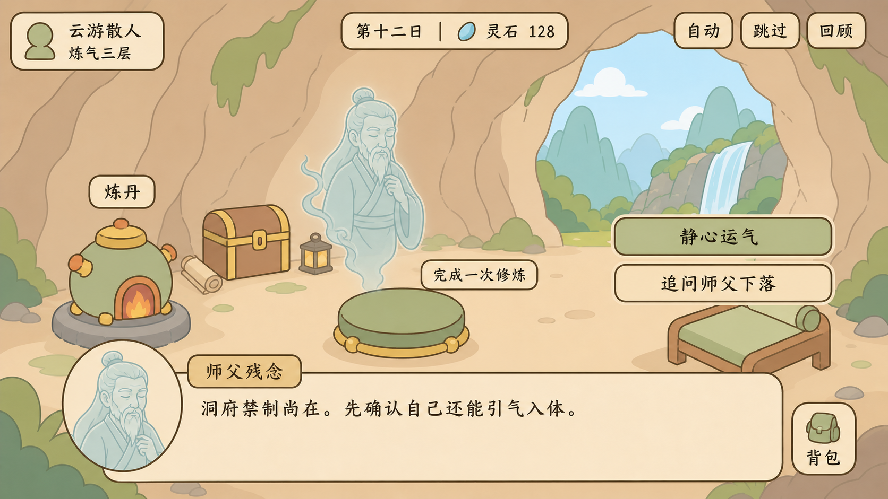

# 剧情播放模块设计

## 界面示意



示意图同时展示对白、角色立绘、分支选择、自动/跳过/回顾控制，以及对场景内目标的引导聚焦。正式实现应继续复用项目现有的米黄纸面板、木牌按钮、深棕描边与低饱和背景。

## 目标

剧情播放模块负责把数据化剧情转换为 UI 可消费的剧情帧，同时保持与场景、存档、奖励和引导系统解耦。

首版支持：

- 单句对白与旁白。
- 条件分支和选择结果。
- 业务命令帧，例如切换场景、聚焦按钮、等待游戏事件、发放奖励。
- 剧情局部变量。
- 播放快照与恢复。
- 配置引用校验。

不由播放器直接负责：

- 修改 `GameState` 或 `DataStore.savedata`。
- 切换场景、发奖励、播放音频和操作具体 UI 节点。
- 打字机动画、立绘过渡、跳过确认等表现逻辑。

这些行为由宿主控制器消费命令帧后执行。业务执行成功，再调用 `advance()` 确认推进。

## 模块结构

| 文件 | 职责 |
|---|---|
| `scripts/story/story_player.gd` | 运行剧情、选择分支、生成剧情帧、快照恢复 |
| `scripts/story/story_condition.gd` | 判断条件并应用剧情局部变量效果 |
| `scripts/story/story_validator.gd` | 校验节点类型、跳转引用、条件与效果 |
| `data/gushi/*.json` | 剧情配置 |
| 未来 `story_presenter.gd` | 将 `line`、`choice` 帧渲染为具体 UI |
| 未来 `story_command_router.gd` | 将命令映射到场景、奖励、引导等业务服务 |

## 数据协议

每个剧情文件包含 `id`、`entry` 和以节点 ID 为键的 `nodes`。

节点类型：

| 类型 | 用途 | 必要字段 |
|---|---|---|
| `line` | 对白或旁白 | `text`, `next` |
| `choice` | 玩家选择 | `choices[]` |
| `command` | 请求宿主执行业务动作 | `commands[]`, `next` |
| `end` | 结束剧情 | `result` |

选择项可包含：

```json
{
  "id": "help",
  "label": "渡入法力",
  "requires": [{"flag": "player.mp", "op": "gte", "value": 10}],
  "effects": [{"flag": "story.helped", "op": "set", "value": true}],
  "next": "help_result"
}
```

`requires` 支持 `eq`、`neq`、`has`、`gte`、`lte`。`effects` 支持 `set`、`add`、`erase`。这些效果只修改播放器局部状态，持久业务状态必须通过命令完成。

## 标准剧情帧

`StoryPlayer.current_frame()` 返回统一字典：

```gdscript
{
	"ok": true,
	"story_id": "prologue.fragment",
	"node_id": "wake",
	"type": "line",
	"speaker": "师父残念",
	"text": "洞府禁制尚在。",
	"portrait": "",
	"meta": {},
	"can_advance": true,
}
```

UI 只依赖帧协议，不读取原始剧情文件。这样后续可同时提供全屏演出、普通对白框、历练事件卡和引导提示等不同 Presenter。

## 推荐集成方式

新增全局 `StoryDirector` 作为会话编排器，但不要让 `StoryPlayer` 自身成为 Autoload。

```text
业务触发器
  -> StoryDirector.start(story_id, context)
  -> StoryPlayer 生成 frame
  -> StoryPresenter 渲染 line / choice
  -> StoryCommandRouter 执行 command
  -> StoryDirector 保存进度并继续
```

`StoryDirector` 后续应负责：

- 从故事仓库按 ID 加载剧情。
- 合并只读业务上下文和剧情局部状态。
- 将正在播放的剧情快照写入 `DataStore.rundata`。
- 将已完成剧情、关键选择和永久剧情标记写入 `DataStore.savedata`。
- 管理跳过、回顾、自动播放和输入锁。

## 存档边界

建议在 `savedata` 增加：

```gdscript
"story": {
	"completed": [],
	"flags": {},
	"history": [],
}
```

建议在 `rundata` 增加：

```gdscript
"story": {
	"active_snapshot": {},
	"pending_command": {},
}
```

`active_snapshot` 用于读档恢复当前节点；`pending_command` 用于避免奖励或场景跳转在恢复时重复执行。对会产生永久影响的命令，应附带稳定 `dedupe_key`。

## 命令约定

首批推荐命令：

| 命令 | 示例用途 |
|---|---|
| `scene_go` | 通过 `SceneManager` 切换场景 |
| `guide_focus` | 聚焦或高亮 UI 控件 |
| `await_game_event` | 等待修炼完成、战斗胜利等事件 |
| `grant_reward` | 通过奖励服务发放内容，必须带 `dedupe_key` |
| `set_game_flag` | 通过受控服务写永久剧情标记 |
| `play_audio` | 请求表现层播放音乐或音效 |

命令路由器应采用白名单，不允许剧情 JSON 指定任意方法名或节点路径。

## 测试策略

- 配置测试：所有剧情均通过 `StoryValidator`，所有跳转引用存在。
- 核心测试：对白推进、选择过滤、局部效果、命令确认、快照恢复。
- 集成测试：命令路由器只调用允许的服务，永久命令具备幂等性。
- 场景测试：不同分辨率下对白框不遮挡关键操作，跳过与自动播放可中止。

当前示例 `data/gushi/prologue_fragment.json` 对应新手引导开场的一小段，可作为后续完整序章的数据模板。
