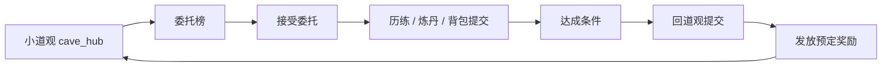

# 道观委托系统设计案

> **维护约定**：委托系统先服务小道观主循环。调整委托规则、配置表、UI 或结算时，同步更新本文；变更摘要只写入文末「变更记录」。
>
> **UI 细案**：界面布局、节点树和交互状态见 `docs/weituo-system-ui-design.md`。

---

## 1. 系统目标

委托系统把玩家已有的修炼、历练、炼丹和背包资源转化为明确短期目标：道观接到附近修士、坊市或村镇的请求，玩家在道观「委托榜」接受委托，完成条件后回道观提交，获得配置中预定的固定奖励。

玩家应感受到：

1. 小道观不只是菜单大厅，而是在世界里承接人情与事务。
2. 每次外出或炼丹前多一个轻量决策：顺手完成哪张委托最划算。
3. 奖励可预期，不靠提交时随机，玩家能围绕奖励规划行动。

本系统不替代历练掉落、炼丹和主线事件；它只给现有活动加一层目标和回收口。

---

## 2. 核心循环



### Moment-to-Moment

- **动作**：玩家打开委托榜，比较需求、地点、耗时和奖励。
- **反馈**：委托卡显示状态：可接受 / 进行中 / 可提交 / 已完成。
- **奖励**：提交时弹出固定奖励提示，并写入活动日志。

### Session Loop

- **目标**：接受 1-3 个 `[PLACEHOLDER]` 与当前计划兼容的委托。
- **张力**：背包材料是自己留用还是交付；历练风险是否值得为委托多跑一趟。
- **解决**：回道观提交，获得灵石、材料、丹药、典籍或声望类奖励。

### Long-Term Loop

- **进度**：完成委托提高道观信誉，解锁更高阶委托池。
- **保留钩子**：高信誉委托给稀有但固定的目标奖励，例如功法书、丹方线索、筑基材料。

---

## 3. 功能点总览

| # | 功能 | 简述 | 实现要点 |
|---|------|------|----------|
| F01 | 道观入口 | 小道观增加「委托榜」入口 | `cave_hub` 进入委托面板；固定 UI 写 `.tscn` |
| F02 | 委托列表 | 展示当前可见委托、进行中委托、可提交委托 | 数据来自 `data/weituo.yaml` + `DataStore.savedata["weituo"]` |
| F03 | 接受委托 | 玩家接受后写入存档 | 限制同时进行数量 `[PLACEHOLDER] 3`，避免刷满无决策 |
| F04 | 条件追踪 | 材料、炼丹成品、历练结果三类条件 | 优先复用背包、炼丹、历练结算，不做新小游戏 |
| F05 | 提交委托 | 条件满足后在道观提交 | 消耗交付物，调用 `RewardService.apply_rewards()` 发固定奖励 |
| F06 | 预定奖励 | 奖励在配置表中写死，提交时不 roll | 使用现有 `RewardEntry` 格式：`kind/id/count` |
| F07 | 失败与放弃 | 玩家可放弃未提交委托 | v1 不做惩罚；只清 active 记录 |
| F08 | 校验 | 检查物品、地点、奖励引用合法 | 接入 `run_config_validation_tests.gd` |

---

## 4. 委托类型

### 4.1 交付委托

**Purpose**：给多余材料和丹药一个稳定去处。  
**Player Fantasy**：道观替附近修士备药、救急、周转资源。  
**Input**：玩家拥有指定物品数量。  
**Output**：提交时扣除物品，发放固定奖励。  
**Success Condition**：背包数量足够时「提交」按钮可用。  
**Failure State**：背包不足时显示缺口，不扣物品。  
**Edge Cases**：

- 交付物在历练运行时背包中：必须等历练结算回写存档后才能提交。
- 玩家接受后把材料用掉：委托保留进行中，显示当前缺口。
- 多个委托要同一物品：提交时按当前选择扣除，不预占库存。

适合 v1 的需求：

| 委托 | 需求 | 奖励方向 | 设计意图 |
|------|------|----------|----------|
| 采药急件 | 灵草 / 良品灵草 | 灵石 + 回气丹 | 引导青岚山采集 |
| 备一炉聚气丹 | 聚气丹 | 灵石 + 炼丹心得 | 把炼丹产出接回委托 |
| 修士疗伤 | 疗伤丹 | 灵石 + 声望 | 给恢复丹药消耗口 |

### 4.2 历练委托

**Purpose**：把外出历练变成明确目标，而不是纯刷掉落。  
**Player Fantasy**：道观受托巡山、查探、驱逐妖兽。  
**Input**：接受委托后完成指定地点的一次历练结算。  
**Output**：历练结算记录进度；回道观提交领取固定奖励。  
**Success Condition**：`GameState.settle_lilian()` 记录满足地点、胜败和最低步数的进度。  
**Failure State**：战败可记录部分进度，但不能提交需要胜利的委托。  
**Edge Cases**：

- 玩家未接受委托就先完成历练：v1 不倒追进度，避免误领。
- 历练中途手动返程：只有满足 `min_steps` `[PLACEHOLDER]` 才计入。
- 同一次历练满足多个 active 委托：允许一起计进度，提交奖励仍逐个领取。

适合 v1 的需求：

| 委托 | 需求 | 奖励方向 | 设计意图 |
|------|------|----------|----------|
| 巡青岚山路 | 完成 `qinglan_mountain` 历练，至少 `[PLACEHOLDER] 3` 步 | 灵石 + 基础药材 | 新手顺路目标 |
| 野狼谷查探 | 完成 `wild_wolf_valley` 历练且未战败 | 灵石 + 妖丹 | 给战斗准备一个理由 |
| 雾溪采样 | 完成 `mist_hidden_valley` 历练，至少 `[PLACEHOLDER] 4` 步 | 筑基材料 | 筑基后目标 |

### 4.3 暂缓类型

以下类型先不进 v1：

- 限时失败惩罚：会逼玩家改行程，先等基础节奏稳定。
- NPC 派遣 / 道观弟子自动完成：需要新角色与离线进度，暂缓。
- 多段剧情委托链：已有事件链系统可承担，委托只挂结果奖励。

---

## 5. 状态机

| 状态 | 含义 | 可执行操作 |
|------|------|------------|
| `locked` | 条件未解锁 | 不显示或置灰 |
| `available` | 可接受 | 接受 |
| `active` | 进行中 | 查看目标、放弃 |
| `ready` | 条件已满足 | 提交 |
| `completed` | 已完成且不可重复 | 查看记录 |

重复委托不进入 `completed` 封存，而是在提交后清出 active，等待下一次刷新。

---

## 6. 数据与配置

### 6.1 配置文件

新增 `res://data/weituo.yaml`。

```yaml
schema_version: 1

rules:
  active_limit: 3 # [PLACEHOLDER] 控制同时目标数量，先保持选择压力
  refresh_days: 30 # [PLACEHOLDER] 贴合一次普通历练周期

weituo:
  qinglan_herb_delivery_001:
    id: "qinglan_herb_delivery_001"
    title: "采药急件"
    issuer: "青石坊市药铺"
    desc: "坊市药铺缺一批入门灵草，请清铃观代为周转。"
    repeatable: true
    unlock:
      min_realm_index: 0
      city_id: "qingshi_market"
    requirements:
      - kind: "item"
        id: "items_LingCao"
        count: 6
        consume: true
    rewards:
      - kind: "currency"
        id: "ling_stones"
        count: 36
      - kind: "item"
        id: "items_HuiQiDan"
        count: 1

  qinglan_patrol_001:
    id: "qinglan_patrol_001"
    title: "巡青岚山路"
    issuer: "山下村正"
    desc: "山路近日有妖兽踪迹，请清铃观巡查一程。"
    repeatable: true
    unlock:
      min_realm_index: 0
      location_id: "qinglan_mountain"
    requirements:
      - kind: "expedition"
        location_id: "qinglan_mountain"
        min_steps: 3 # [PLACEHOLDER] 防止进图立刻返程
        require_not_defeated: false
    rewards:
      - kind: "currency"
        id: "ling_stones"
        count: 45
      - kind: "item"
        id: "items_LingCao"
        count: 3
```

### 6.2 存档字段

新增 `DataStore.savedata["weituo"]`，不放平行单例。

```gdscript
{
	"active": {
		"instance_id": {
			"weituo_id": "qinglan_patrol_001",
			"accepted_day": 12,
			"progress": {
				"lilian_steps": 3,
				"not_defeated": true
			}
		}
	},
	"completed_once": ["qinglan_herb_delivery_001"],
	"completed_count": {
		"qinglan_patrol_001": 2
	},
	"board": {
		"refresh_day": 1,
		"offer_ids": ["qinglan_herb_delivery_001", "qinglan_patrol_001"]
	}
}
```

读档兼容：

- `_default_savedata()` 增加 `weituo` 默认结构。
- `coalesce_savedata()` 合并缺失字段。
- 委托进度必须从 `DataStore.savedata` 读写；临时 UI 选择可放 `DataStore.ui_runtime()`。

---

## 7. 奖励与数值

委托奖励为固定配置，不使用掉落池。奖励价值以现有物品 `ling_shi` 估价和历练奖励预算做参考。

| 变量 | 初始假设 | 理由 | 破坏信号 |
|------|----------|------|----------|
| active_limit | `[PLACEHOLDER] 3` | 足够让玩家规划，不会把面板变成清单作业 | 玩家每次全接且不思考 |
| refresh_days | `[PLACEHOLDER] 30` | 对齐普通历练基础耗时 | 玩家错过太久或刷新无感 |
| 交付奖励倍率 | `[PLACEHOLDER] 1.2x` 交付物估值 | 玩家牺牲可自用材料，需要小幅溢价 | 比直接历练收益高太多 |
| 历练委托奖励 | `[PLACEHOLDER] 0.25-0.4x` 同地点一次历练期望收益 | 委托是额外目标，不应压过历练本身 | 玩家只刷委托刷新，不看地点收益 |

奖励边界：

- 不给同时提升攻击、防御、修炼、掉落的全能奖励。
- 低阶委托主要给灵石、基础丹药、常用材料。
- 稀有功法书、技能书、筑基材料只放到一次性或高信誉委托。

---

## 8. UI 行为

### 8.1 场景拆分

```text
scenes/ui/weituo_board_panel.tscn
scenes/ui/components/weituo_card.tscn
scripts/ui/weituo_board_panel.gd
scripts/ui/components/weituo_card.gd
scripts/sim/weituo_service.gd
```

固定布局写在 `.tscn`；脚本只做数据绑定、状态切换和信号处理。需要脚本访问的节点设置 `unique_name_in_owner = true`，脚本使用 `%NodeName`。

### 8.2 面板布局

- 顶部：标题、当前可接数量、刷新说明。
- 左侧：筛选按钮：全部 / 可接 / 进行中 / 可提交。
- 中央：委托卡列表。
- 右侧：选中委托详情，展示需求、进度、预定奖励。
- 底部：接受 / 放弃 / 提交按钮。

### 8.3 委托卡字段

| 字段 | 展示 |
|------|------|
| 标题 | `title` |
| 发布者 | `issuer` |
| 类型 | 交付 / 历练 |
| 目标摘要 | `灵草 4/6`、`青岚山脉 3/3 步` |
| 状态 | 可接受 / 进行中 / 可提交 |
| 奖励预览 | 复用物品格或奖励行组件 |

---

## 9. 服务职责

### `WeituoService`

- 读取 `data/weituo.yaml`。
- 返回当前可见委托列表。
- `accept(weituo_id)`：写入 active。
- `can_submit(instance_id)`：检查需求是否满足。
- `submit(instance_id)`：扣交付物，调用 `RewardService.apply_rewards(GameState, rewards, "weituo")`，更新完成记录。
- `record_lilian_result(result)`：由 `GameState.settle_lilian()` 后调用，更新 active 历练委托进度。

### `weituo_board_panel.gd`

- 绑定列表、详情和按钮状态。
- 发出接受、放弃、提交请求。
- 不直接修改背包、灵石或历练结果。

---

## 10. 验收标准

- 道观能打开委托榜，看到至少 2 个 v1 委托。
- 玩家可接受委托，存档后读档仍保留 active 状态。
- 交付类委托在背包不足时不能提交，数量足够时提交会扣物品。
- 历练类委托只在接受后记录进度，满足条件后可提交。
- 提交奖励走 `RewardService.apply_rewards()`，奖励提示和活动日志可见。
- 新配置引用物品、地点、奖励类型均通过配置校验。
- 不新增平行全局状态，不在脚本动态创建固定 UI 节点。

---

## 11. 最小实施顺序

1. 新增 `data/weituo.yaml`，先放 2 个委托：采药急件、巡青岚山路。
2. 在 `DataStore` 增加 `weituo` 默认值和合并逻辑。
3. 新增 `WeituoService`，只实现交付、接受、提交、固定奖励。
4. 新增委托榜面板和卡片子场景，接到小道观入口。
5. 接入历练结算进度。
6. 补配置校验和最小测试。

---

## 12. 变更记录

| 日期 | 变更摘要 |
|------|----------|
| 2026-06-28 | 新增道观委托系统设计案：固定榜单、接受、提交、预定奖励与最小实施顺序 |
